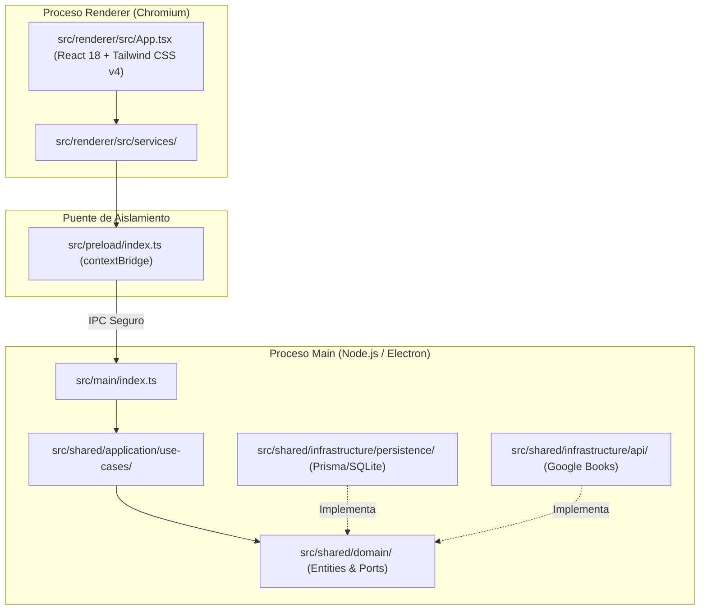

# ADR-001: Scaffolding con Electron-Vite, React 18, Tailwind CSS v4 y Vitest

## Contexto
Para el inicio del proyecto BookLog se necesitaba un entorno de desarrollo de escritorio moderno, rápido y tipado de forma estricta. La aplicación requiere:
1. Soporte para entorno de escritorio multiplataforma (Electron).
2. Un ciclo de desarrollo ágil con HMR (Hot Module Replacement) tanto para el frontend como para el proceso principal.
3. Tipado estricto en TypeScript para minimizar errores en tiempo de ejecución.
4. Una estructura Clean Architecture desacoplada que permita migrar la lógica o el frontend a la web en el futuro sin reescribir la lógica de dominio.
5. Un framework de testing rápido para TDD/verificación continua.

## Decisión
Se decidió utilizar:
- **electron-vite**: Para orquestar la compilación separada del proceso Main (Node.js), Preload (context isolation) y Renderer (React + Vite) con configuración centralizada.
- **React 18 + Tailwind CSS v4**: Frontend modular y reactivo. Se utiliza `@tailwindcss/vite` para procesamiento CSS de última generación mediante `@import "tailwindcss";` sin necesidad de configuraciones redundantes de PostCSS.
- **TypeScript Strict**: Con flags `strict: true` y `noUncheckedIndexedAccess: true` tanto en `tsconfig.node.json` como en `tsconfig.web.json`, garantizando seguridad en índices de arrays y null checks.
- **Clean Architecture Directory Layout**:
  - `src/main/`: Ciclo de vida de la ventana Electron y handlers de sistema.
  - `src/preload/`: Puente seguro con `contextBridge`.
  - `src/renderer/`: Interfaz de usuario en React.
  - `src/shared/domain/`: Entidades, value objects y puertos (interfaces).
  - `src/shared/application/`: Casos de uso desacoplados.
  - `src/shared/infrastructure/`: Implementaciones de persistencia, IPC y APIs externas.
- **Vitest**: Motor de testing unitario compatible con ESM y la configuración de Vite, configurado en modo `run` por defecto para pipelines y scripts de verificación.
- **pnpm**: Gestor de paquetes rápido con almacenamiento inmutable por enlace duro.

## Alternativas descartadas
- **Electron Forge / webpack**: Descartado por tiempos de inicio y recarga lentos en comparación con la arquitectura basada en Rollup/esbuild de Vite.
- **Create React App / CRACO**: Descartado por estar obsoleto y carecer de optimización para Electron.
- **Tailwind CSS v3**: Descartado en favor de v4 para aprovechar el nuevo motor Oxide y la integración directa con Vite sin archivos de configuración pesados.

## Diagrama de Procesos y Capas

