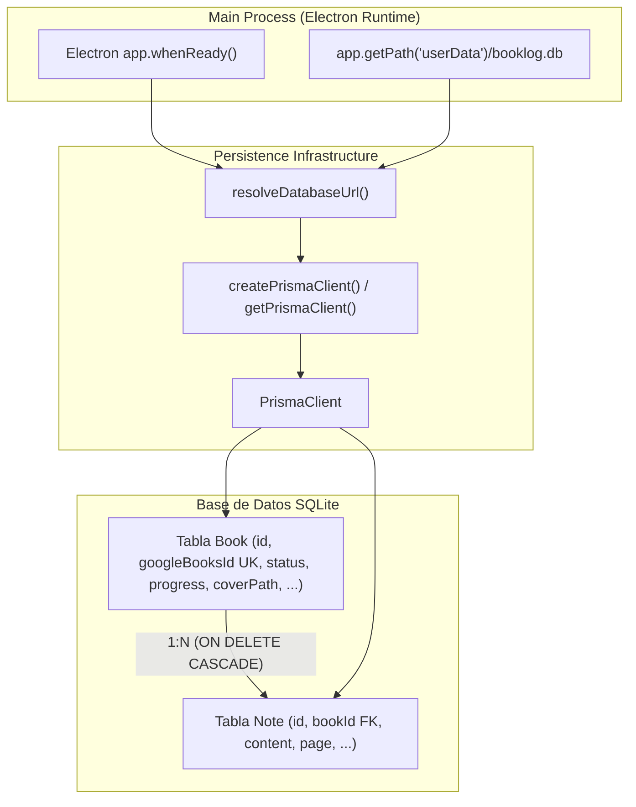

# ADR-002: Esquema de Base de Datos con Prisma y SQLite en Electron

## Contexto
BookLog es una aplicación de escritorio local-first para el seguimiento de lecturas personales. Se requiere un mecanismo de persistencia confiable, tipado y ligero que cumpla con los siguientes requisitos:
1. Almacenamiento local en el equipo del usuario sin depender de servicios en la nube ni requerir instalación de servidores de bases de datos.
2. Soporte para modelos relacionales con integridad referencial (`Book` con múltiples `Note`) y eliminación en cascada.
3. Compatibilidad con el empaquetado de Electron y resolución dinámica del path al directorio `userData` (`app.getPath('userData')`), ya que el directorio del binario de la aplicación es de sólo lectura tras su instalación.
4. Generación de tipos estricta y sincronizada con el esquema de la base de datos para integrarse sin fricción con TypeScript strict.
5. Aislamiento total en tests automatizados para evitar corrupción o borrado de datos de producción/usuario.
6. Soporte para gestión de progreso tanto por página como por porcentaje, estado pausado de lectura (`PAUSED`), notas asociadas por página y almacenamiento offline-first de portadas en disco local (`coverPath`).

## Decisión
Se decidió implementar la persistencia mediante **Prisma ORM (v6.4.1)** con motor **SQLite**:
- **Schema declarativo (`prisma/schema.prisma`)**:
  - Modelo `Book`: Define `id` autoincremental, `googleBooksId` con constraint `@unique`, título, autores (texto serializado para flexibilidad), estado (`BookStatus` enum: `TO_READ`, `READING`, `PAUSED`, `FINISHED`, `ABANDONED`), calificación (1-5), campos de progreso de lectura (`pageCount`, `currentPage`, `progressPercentage`), rutas de portada (`coverUrl` para URL remota y `coverPath` para archivo local en caché/offline), marcas de tiempo (`createdAt`, `updatedAt`) y relación 1:N con `Note[]`.
  - Modelo `Note`: Define `id`, `bookId` con clave foránea a `Book(id)` y directiva `onDelete: Cascade`, contenido textual de la nota (`content`), página de referencia opcional (`page`), y marcas de tiempo (`createdAt`, `updatedAt`).
  - Remoción de `ReadingSession`: Se descartó el modelo de sesiones de lectura cronometradas en favor de un modelo centrado en progreso directo y notas asociadas.
- **Factoría dinámica de PrismaClient (`src/shared/infrastructure/persistence/prismaClient.ts`)**:
  - Resuelve la ruta SQLite con prioridad: (1) `customUrl` explícita, (2) variable de entorno `DATABASE_URL`, (3) ruta a `app.getPath('userData')/booklog.db` si se ejecuta en el proceso Main de Electron, (4) archivo `./dev.db` de respaldo para CLI y desarrollo.
  - Ofrece funciones `getPrismaClient()` (singleton para la aplicación) y `createPrismaClient(customUrl)` (para tests aislados).
- **Prisma Migrations**:
  - Se utiliza `prisma migrate dev` para el versionado incremental y generación de scripts DDL SQL (`prisma/migrations/20260930145056_init/` y `prisma/migrations/20260930153235_update_schema_book_notes_progress/`).
- **Aislamiento en Tests**:
  - En pruebas de integración (`tests/infrastructure/test_prisma_connection.test.ts`), cada ejecución crea un archivo SQLite temporal efímero en `os.tmpdir()`, ejecuta todas las migraciones en orden cronológico y valida creación de Book con nuevos campos, creación y consulta de notas asociadas, borrado en cascada y constraints únicos, eliminando los archivos temporales al concluir.

## Alternativas descartadas
- **Almacenamiento en archivos JSON / electron-store / Lowdb**: Descartado debido a la ausencia de integridad referencial ACID, falta de borrado en cascada nativo, deficiencia en consultas complejas (filtrados, ordenamientos, agregaciones para estadísticas) y riesgo de corrupción en escrituras concurrentes.
- **TypeORM / Knex / better-sqlite3 directo**: Descartado por requerir dependencias nativas compiladas con node-gyp que complican significativamente el empaquetado multiplataforma en Electron (`electron-builder`), así como por una experiencia de tipado y migraciones inferior a la de Prisma.
- **Prisma 7.x/8.x (Driver Adapters obligatorios)**: Descartado en esta etapa debido a que eliminan la directiva `url` directa en `schema.prisma` y fuerzan el uso de adaptadores experimentales (`@prisma/adapter-libsql` o similares), añadiendo complejidad innecesaria sobre un motor SQLite local estándar. Prisma 6.4.1 proporciona máxima estabilidad y compatibilidad con el ecosistema Node/Electron.

## Diagrama de Relación y Arquitectura

