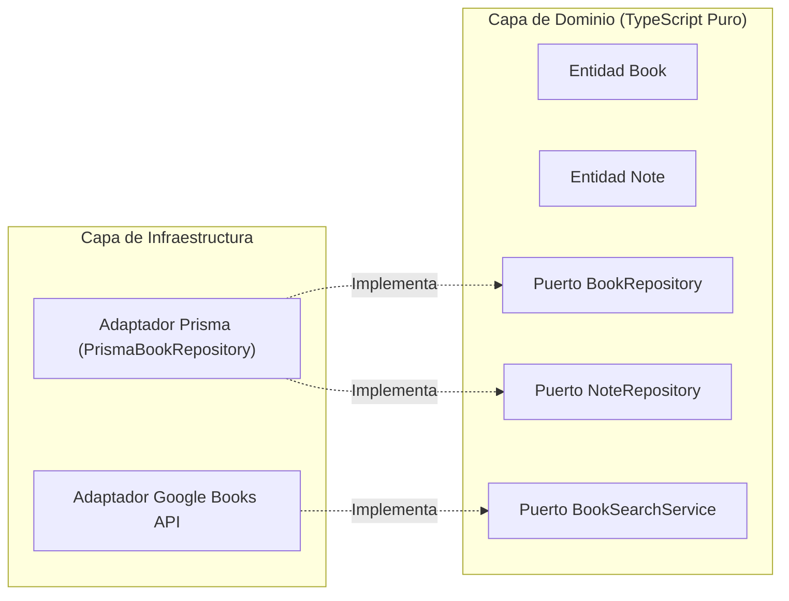

# ADR-003: Entidades del Dominio y Puertos de Persistencia

## Estado
Aceptado

## Contexto
En BookLog, la lógica de negocio nuclear comprende la administración de la biblioteca personal, el cálculo bidireccional del progreso de lectura (por página física y por porcentaje de avance), la gestión de estados del libro y la captura de notas asociadas.

Para salvaguardar la mantenibilidad a largo plazo y evitar el acoplamiento directo del modelo de negocio con Prisma ORM, SQLite o Electron, se requiere una capa de dominio aislada con entidades enriquecidas y puertos bien definidos siguiendo los postulados de Clean Architecture.

## Decisiones

### 1. Independencia Absoluta de la Capa de Dominio
- Ningún módulo en `src/shared/domain/` tiene dependencias de `@prisma/client`, librerías de persistencia o APIs nativas de Electron.
- Toda la capa está tipada con TypeScript estricto y resolución de módulos ECMAScript con extensión obligatoria `.js`.
- La instanciación y reconstitución de entidades se realiza mediante métodos de fábrica estáticos (`create`, `fromPrimitives`) y serialización desacoplada (`toPrimitives`).

### 2. Entidades Ricas con Invariantes de Negocio
- **Entidad `Book` (`src/shared/domain/entities/Book.ts`)**:
  - Encapsula atributos como `title`, `authors`, `pageCount`, `currentPage`, `progressPercentage`, `rating`, `status`, `coverUrl`, `coverPath` y `notes`.
  - Valida obligatoriedad de título y autores (no vacíos ni únicamente espacios en blanco).
  - Valida que `rating`, si se especifica, sea un número entero entre 1 y 5.
  - Valida que `pageCount`, si se especifica, sea un número entero $\ge 1$.
  - **Progreso Bidireccional:**
    - `updateProgressByPage(currentPage)`: Valida $0 \le \text{currentPage} \le \text{pageCount}$ y computa automáticamente $\text{progressPercentage} = \text{round}((\text{currentPage} / \text{pageCount}) \times 100)$.
    - `updateProgressByPercentage(progressPercentage)`: Valida $0 \le \text{progressPercentage} \le 100$ y computa automáticamente $\text{currentPage} = \text{round}((\text{progressPercentage} / 100) \times \text{pageCount})$.
  - **Transición de Estados:**
    - Al cambiar a `FINISHED`: el porcentaje se ajusta a 100 y `currentPage` se iguala a `pageCount` (si existe).
    - Al cambiar a `TO_READ`: se preserva el progreso previo registrado (no se reinicia a 0).
- **Entidad `Note` (`src/shared/domain/entities/Note.ts`)**:
  - Requiere contenido no vacío (`trimmed length > 0`).
  - Permite página opcional, pero si está presente exige que sea un entero $\ge 1$.
  - Requiere `bookId` entero positivo $> 0$.

### 3. Puertos de Repositorios y Servicios Externos
- `BookRepository` (`src/shared/domain/ports/BookRepository.ts`): Contrato para operaciones de persistencia de libros (`findAll`, `findById`, `findByStatus`, `create`, `update`, `delete`).
- `NoteRepository` (`src/shared/domain/ports/NoteRepository.ts`): Contrato para notas asociadas a libros (`findByBookId`, `findById`, `create`, `update`, `delete`).
- `BookSearchService` (`src/shared/domain/ports/BookSearchService.ts`): Contrato para el proveedor externo de búsqueda de metadatos de libros (`searchByQuery`).

## Consecuencias

### Positivas
- **Alta testabilidad:** La lógica de negocio, cálculos de avance y validaciones de estado se prueban exhaustivamente con Vitest en memoria sin necesidad de levantar bases de datos ni migraciones SQLite.
- **Bajo acoplamiento:** Cambios futuros en el ORM o en la base de datos no alteran las reglas ni la estructura del dominio.
- **Garantía de integridad:** Es imposible crear o dejar una entidad en un estado inconsistente (por ejemplo, página actual superior al total de páginas o calificaciones fuera de rango).

### Consideraciones
- Requiere mapeo explícito entre los modelos de Prisma y las entidades de dominio a través de adaptadores (`toPrimitives` / `fromPrimitives`), introduciendo una capa deliberada de conversión que previene la propagación de deuda técnica.
