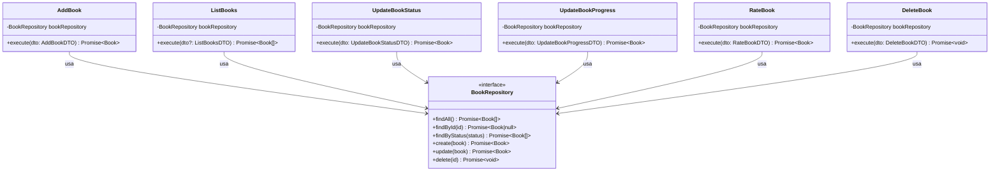

# ADR-005: Casos de Uso de Libros y Progreso de Lectura

## Estado
Aceptado

## Contexto
En las Features #3 y #4 se establecieron las entidades de dominio ricas (`Book`, `Note`) y los repositorios de persistencia con Prisma (`PrismaBookRepository`, `PrismaNoteRepository`).
Para habilitar las operaciones de negocio de la biblioteca desde los controladores IPC de Electron sin acoplar la presentación a la infraestructura de base de datos, se requiere diseñar la **Capa de Aplicación** mediante Casos de Uso atómicos y desacoplados.

Se acordaron dos decisiones de diseño fundamentales con el usuario:
1. **Error Tipado para Recursos No Encontrados:** Lanzar `BookNotFoundError` ante intentos de operar sobre libros inexistentes.
2. **Transición Automática a FINISHED:** Al actualizar el progreso de lectura (`UpdateBookProgress`), si el libro alcanza el 100% de avance o llega a la última página, debe transicionar de forma automática su estado a `BookStatus.FINISHED`.

---

## Decisiones

### 1. Organización y Nomenclatura de Casos de Uso
Se crearon casos de uso dedicados en `src/shared/application/use-cases/`, cada uno con su correspondiente interfaz DTO:
- `AddBook`: Recibe `AddBookDTO`, crea la entidad `Book` validando invariantes y la persiste mediante `bookRepository.create(book)`.
- `ListBooks`: Recibe opcionalmente `{ status?: BookStatus }`. Si se provee, consulta `bookRepository.findByStatus(status)`; en caso contrario invoca `bookRepository.findAll()`.
- `UpdateBookStatus`: Modifica el estado del libro. Si el libro no existe en el repositorio, lanza `BookNotFoundError`.
- `UpdateBookProgress`: Permite actualizar el avance por `page` o por `percentage`. Realiza la sincronización bidireccional y evalúa la regla de transición automática a `FINISHED`.
- `RateBook`: Asigna una calificación de 1 a 5 estrellas o remueve la calificación si se envía `null`/`undefined`. Lanza `BookNotFoundError` si el libro no existe.
- `DeleteBook`: Verifica la existencia del libro (lanzando `BookNotFoundError` si no existe) y solicita su eliminación a `bookRepository.delete(id)`.
- `GetBookById`: Consulta un libro por su ID o lanza `BookNotFoundError`.

### 2. Manejo de Errores Tipados de Aplicación (`BookNotFoundError`)
- Se implementó la clase `BookNotFoundError` en `src/shared/application/errors/BookNotFoundError.ts` que hereda de `Error`.
- Almacena la propiedad tipada `bookId: number` y el nombre `BookNotFoundError`, facilitando el mapeo en los manejadores IPC hacia códigos de error entendibles por el frontend.

### 3. Transición Automática a `FINISHED` en Progreso
- En `UpdateBookProgress`, luego de aplicar `book.updateProgressByPage` o `book.updateProgressByPercentage`, se evalúan las condiciones:
  - `book.progressPercentage === 100`, o
  - `book.currentPage === book.pageCount` (con `pageCount > 0`).
- Si cualquiera de las dos condiciones se cumple, se invoca `book.updateStatus(BookStatus.FINISHED)`. Esto garantiza la consistencia del catálogo sin requerir una acción manual separada del usuario al terminar de leer la última página.

### 4. Inyección de Dependencias Estricta
- Todos los casos de uso reciben el puerto `BookRepository` en su constructor (`constructor(private readonly bookRepository: BookRepository)`).
- Esto garantiza el principio de inversión de dependencias (DIP) y permite tests unitarios aislados con mocks en memoria sin dependencias externas.

---

## Diagrama de Casos de Uso

---

## Consecuencias

### Positivas
- **Aislamiento Total:** La capa de presentación (Electron Renderer / IPC) interactúa exclusivamente con Casos de Uso tipados, nunca con el repositorio o la base de datos directamente.
- **Transición Automática:** Experiencia de usuario consistente donde completar el 100% de la lectura actualiza el estado de la biblioteca de forma reactiva y automática.
- **Control de Excepciones:** Errores específicos como `BookNotFoundError` evitan respuestas ambiguas como `null` y permiten mensajes de interfaz precisos.
- **Rendimiento de Pruebas:** Las pruebas unitarias con `MockBookRepository` se ejecutan en < 30 ms sin I/O de disco.
