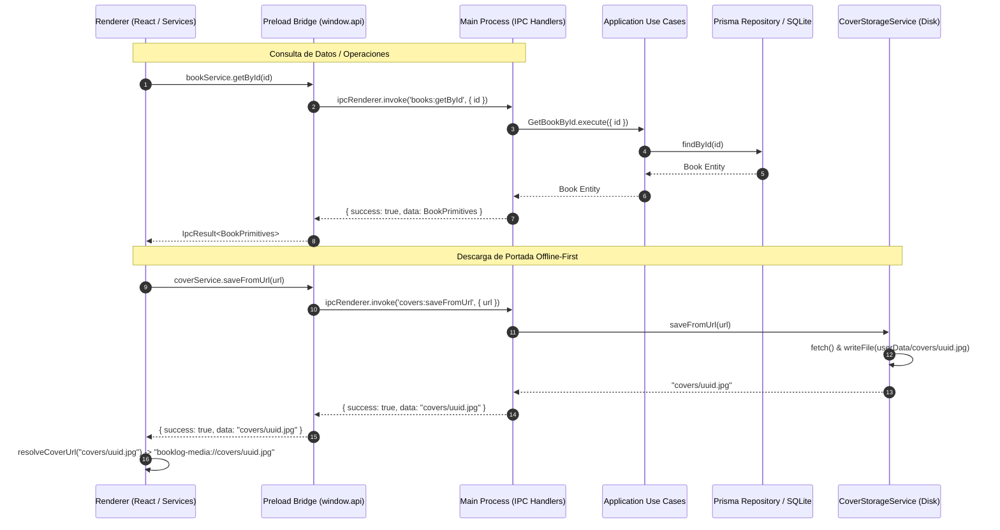

# ADR-007: Capa IPC Main ↔ Renderer, Patrón Result y Almacenamiento Seguro de Portadas

## Estado
Aceptado

## Contexto
En una aplicación Electron con arquitectura Clean Architecture y seguridad moderna, el proceso de renderizado (Chromium Renderer) opera en un entorno restringido con `contextIsolation: true` y sin acceso directo a Node.js ni a la base de datos SQLite.

Para permitir que la interfaz de usuario interactúe con el dominio y la persistencia se requerían tres soluciones fundamentales:
1. **Contratos y Manejo de Errores IPC:** La serialización por defecto de excepciones a través de `ipcRenderer.invoke` pierde la identidad de clases (`BookNotFoundError`, `InvalidBookError`, etc.) y puede resultar en rechazos de promesas no controlados o difíciles de tipar en TypeScript.
2. **Almacenamiento y Renderizado de Portadas (Offline-First):** Las portadas de los libros deben poder guardarse localmente (ya sea desde URLs remotas o archivos locales) y renderizarse de forma fluida en `` sin penalizar la memoria con strings Base64 gigantescos ni requerir levantar servidores HTTP locales.
3. **Seguridad y Tipado en Preload:** Exposición controlada de APIs a través de `contextBridge` garantizando tipado estricto extremo a extremo (Main ↔ Preload ↔ Renderer).

---

## Decisiones

### 1. Patrón `IpcResult<T>` Estricto
Toda comunicación invocada vía `ipcRenderer.invoke` devuelve una estructura unificada y tipada:
```typescript
export type IpcResult<T> =
  | { success: true; data: T }
  | { success: false; error: string; code?: string }
```
- **Main Process:** Los controladores en `src/main/ipc/` capturan cualquier excepción de la capa de aplicación o dominio (`DomainError`, `BookNotFoundError`, `NoteNotFoundError`, `Error`), la formatean con códigos estándar (`BOOK_NOT_FOUND`, `NOTE_NOT_FOUND`, `VALIDATION_ERROR`, `COVER_STORAGE_ERROR`, `INTERNAL_ERROR`) y devuelven `IpcResult<T>`. La promesa IPC siempre resuelve exitosamente, eliminando excepciones no capturadas en el canal.
- **Renderer Process:** El Renderer comprueba `result.success` mediante discriminación de uniones en TypeScript, obteniendo `result.data` con tipado garantizado de primitivos (`BookPrimitives`, `NotePrimitives`) o `result.error` con su respectivo código de diagnóstico.

### 2. Protocolo Personalizado Seguro `booklog-media://`
Para el soporte Offline-First de imágenes de portada:
- Se registra el esquema privilegiado `booklog-media` antes de que la aplicación esté lista (`app.whenReady()`) mediante `protocol.registerSchemesAsPrivileged`.
- Se registra un protocolo de streaming y fetch nativo mediante `protocol.handle('booklog-media', ...)`.
- Las portadas se almacenan en el directorio del usuario: `app.getPath('userData')/covers/<uuid>.<ext>`.
- **Seguridad:** El handler del protocolo normaliza la ruta solicitada, previene ataques de path traversal (`..`) y restringe estrictamente el acceso a archivos ubicados dentro de `app.getPath('userData')`.
- En el Renderer, la URL se resuelve mediante el helper `resolveCoverUrl`, permitiendo `` servido directamente por el motor de red de Chromium sin lecturas síncronas en memoria ni Base64.

### 3. Exposición Controlada mediante `contextBridge`
- Se implementó `src/preload/index.ts` exponiendo `window.api` con namespaces temáticos:
  - `window.api.books`: list, getById, create, updateStatus, updateProgress, rate, delete.
  - `window.api.notes`: getByBook, create, update, delete.
  - `window.api.covers`: saveFromUrl, saveFromLocal.
- Se tipó globalmente la interfaz `Window` en `src/preload/index.d.ts`.
- En `src/renderer/src/services/` se crearon servicios envoltorios (`bookService`, `noteService`, `coverService`) para consumo desacoplado en componentes y hooks de React.

---

## Diagrama de Comunicación IPC



---

## Alternativas Descartadas

1. **Lanzar excepciones (`throw`) en el Main Process hacia el Renderer:**
   - Descartado porque Electron serializa los errores como objetos de error genéricos (`Error`), perdiendo el nombre de la clase (`BookNotFoundError`) y propiedades añadidas (`bookId`, etc.), obligando al Renderer a parsear strings de error frágiles o capturar excepciones en bloques `try/catch` invasivos.
2. **Guardar portadas como Base64 en la base de datos SQLite:**
   - Descartado por degradación severa de rendimiento: la base de datos se infla rápidamente, las consultas `findMany` cargan megabytes innecesarios en memoria y la renderización en el DOM requiere recrear strings Base64 costosos.
3. **Servir imágenes mediante un servidor HTTP local (Express/Node `http`):**
   - Descartado por sobrecarga de dependencias, consumo innecesario de puertos de red locales y potenciales vulnerabilidades de red local. El protocolo custom de Electron `booklog-media://` es nativo, seguro y ultra-rápido.
