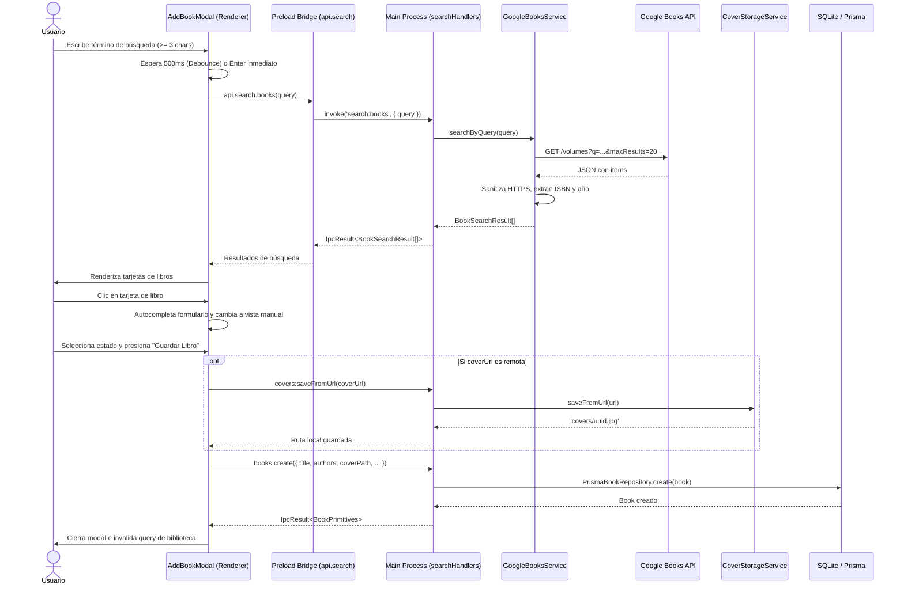

# ADR-010: Integración de Google Books API y Búsqueda con Descarga de Portadas

## Estado
Aceptado

## Contexto
Para enriquecer la experiencia de registro de libros en BookLog, la Feature #10 (`google_books_search`) implementa la búsqueda de libros mediante la API pública de Google Books Volumes. Los usuarios deben poder buscar libros por título, autor o ISBN, visualizar los resultados en tarjetas claras e interactivas, autocompletar automáticamente el formulario de alta con los metadatos obtenidos y persistir la portada remota localmente en disco (`userData/covers/`) para garantizar un funcionamiento offline-first.

---

## Decisiones Adoptadas

### 1. Servicio de Búsqueda Desacoplado en Infraestructura (`GoogleBooksService`)
- **Decisión:** Se implementa `GoogleBooksService` implementando la interfaz de dominio `BookSearchService` (`src/shared/domain/ports/BookSearchService.ts`).
- **Endpoint:** `https://www.googleapis.com/books/v1/volumes?q=${encodeURIComponent(query)}&maxResults=20`.
- **Sanitización y Transformación:**
  - Forzado de protocolo `https://` en todas las URLs de portadas (Google Books frecuentemente devuelve URLs `http://`).
  - Preferencia del campo `thumbnail` sobre `smallThumbnail` para obtener la mejor resolución posible.
  - Extracción prioritaria de `ISBN_13` sobre `ISBN_10`.
  - Normalización de autores como arreglo de strings no vacíos (`string[]`).
  - Extracción de año de 4 dígitos a partir de `publishedDate` (soportando formatos `YYYY-MM-DD`, `YYYY-MM` y `YYYY`).
  - Inyección de dependencia de `fetch` en el constructor para facilitar tests unitarios sin dependencias de red externa.

### 2. Capa IPC Tipada para Búsqueda
- **Decisión:** Se creó el canal `IPC_CHANNELS.SEARCH.BOOKS` (`search:books`), con contratos tipados `IpcResult<BookSearchResult[]>`.
- **Handler en proceso Main:** `registerSearchHandlers` invoca `GoogleBooksService.searchByQuery(query)`, validando queries vacías o inválidas y formateando excepciones con `formatIpcError`.
- **Exposición en Preload:** Se expuso `window.api.search.books(query)` y el cliente `searchService.searchBooks(query)` en el Renderer.

### 3. Experiencia de Usuario en `AddBookModal`
- **Decisión:**
  - Pestañas superiores en el modal: "Buscar en Google" (activa por defecto al abrir) y "Carga manual".
  - Disparo de búsqueda doble: debounce automático de 500ms al tipear (con umbral mínimo de 3 caracteres) Y disparo inmediato al presionar la tecla `Enter` o hacer clic en el botón "Buscar".
  - Control de concurrencia y condiciones de carrera (*race conditions*) mediante identificador incremental de petición (`searchRequestIdRef`), ignorando respuestas de búsquedas superadas.
  - Indicador visual animado de carga (`Loader2` spinner) durante búsquedas activas.
  - Mensajes claros ante estados vacíos (menos de 3 caracteres o sin resultados para el término buscado).
  - Al hacer clic en una tarjeta de resultado:
    - Autocompleta automáticamente los campos `title`, `authors`, `pageCount`, `isbn`, `coverUrl` y `googleBooksId`.
    - Cambia inmediatamente a la pestaña de confirmación ("Carga manual") mostrando un banner informativo de confirmación.
    - El usuario revisa o ajusta los datos, define el estado inicial de lectura y presiona "Guardar Libro".

### 4. Persistencia Offline-First de Portadas Remotas
- **Decisión:** Al guardar el libro, si `coverUrl` es una URL remota (`http://` o `https://`), se invoca `window.api.covers.saveFromUrl(coverUrl)` para descargar el archivo a disco en `userData/covers/` y guardar la ruta local en `coverPath`. Si la descarga falla por problemas de red, se mantiene `coverUrl` sin interrumpir la creación del libro en la base de datos SQLite.

---

## Alternativas Descartadas

1. **Buscar directamente desde el proceso Renderer con `fetch`:** Descartado para cumplir con el aislamiento de contexto y la arquitectura hexagonal de Electron, centralizando las comunicaciones de red y el manejo de APIs externas a través de IPC en la capa de infraestructura del proceso Main/Shared.
2. **Descarga síncrona obligatoria bloqueante de portadas:** Descartado; un fallo de conectividad temporal de Google Books no debe impedir que el usuario guarde el libro en su biblioteca local.
3. **Modal separado para la búsqueda:** Descartado para evitar fragmentación de la interfaz; la integración con pestañas ("Buscar en Google" / "Carga manual") proporciona una transición limpia hacia la confirmación.

---

## Diagrama de Secuencia

