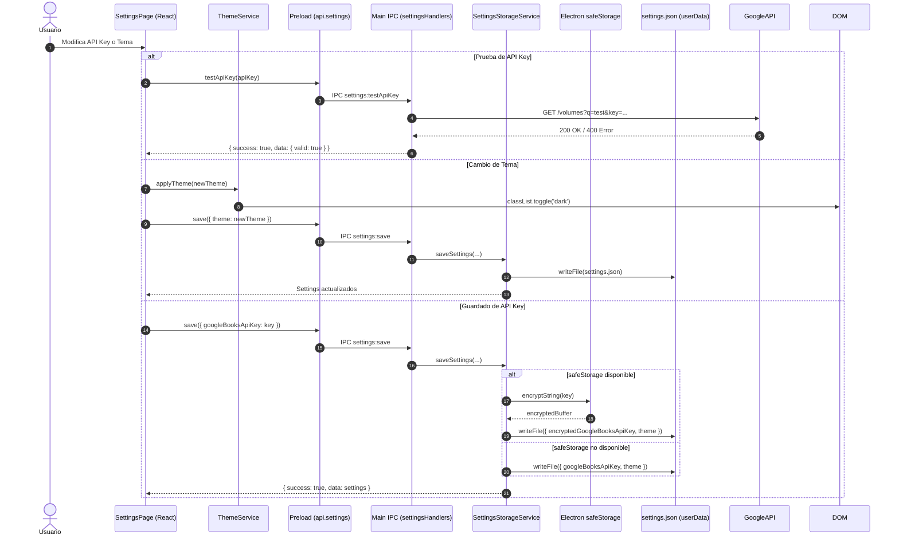

# Guía Técnica: Persistencia de Preferencias, Cifrado Seguro y Selector de Tema

Esta guía técnica documenta la arquitectura de persistencia de configuración del usuario, el cifrado de claves con Electron `safeStorage`, la integración de la API Key con `GoogleBooksService` y la sincronización reactiva de temas visuales en Tailwind CSS v4 para BookLog.

---

## 1. Arquitectura de Configuración y Preferencias

El siguiente diagrama ilustra el flujo de datos entre la interfaz de usuario en React, el puente Preload con aislamiento de contexto, los handlers IPC en el proceso Main y el almacenamiento en disco en `settings.json`.



---

## 2. Persistencia en Main Process: `SettingsStorageService`

### 2.1 Ubicación y Estructura de `settings.json`

El archivo de configuración reside en:
```
<app.getPath('userData')>/settings.json
```

La interfaz TypeScript define el modelo de dominio para los ajustes:

```typescript
export type AppTheme = 'dark' | 'light' | 'system'

export interface AppSettings {
  googleBooksApiKey: string
  theme: AppTheme
}
```

### 2.2 Cifrado Opcional con `safeStorage`

Electron ofrece la API nativa `safeStorage` que delega en el gestor de credenciales del sistema operativo:
- **Windows:** DPAPI (Data Protection API)
- **macOS:** Keychain
- **Linux:** Secret Service API / libsecret

El servicio implementa una estrategia segura de cifrado transparente:

```typescript
// Almacenamiento cifrado si está disponible
if (canEncrypt && this.safeStorageClient) {
  try {
    const encrypted = this.safeStorageClient.encryptString(updatedApiKey)
    dataToSave.encryptedGoogleBooksApiKey = encrypted.toString('base64')
  } catch {
    dataToSave.googleBooksApiKey = updatedApiKey
  }
} else {
  dataToSave.googleBooksApiKey = updatedApiKey
}
```

Al leer el archivo, si existe `encryptedGoogleBooksApiKey` y el entorno soporta `safeStorage.isEncryptionAvailable()`, se desencripta el buffer en memoria. En caso de fallo de descifrado, se recurre a la clave en texto plano si existiese o se inicializa con cadena vacía.

---

## 3. Integración Dinámica con `GoogleBooksService`

Para evitar que la aplicación deba reiniciarse al modificar la clave de la API de Google Books, el proceso principal utiliza un proveedor dinámico síncrono conectado al caché de `SettingsStorageService`:

```mermaid
graph LR
    subgraph "Main Process"
        SS["SettingsStorageService<br/>(Cache en Memoria)"]
        GBS["GoogleBooksService<br/>(BookSearchService)"]
        SH["searchHandlers.ts"]
        
        SS -.->|() => getCachedApiKey()| GBS
        SH --> GBS
    end

    subgraph "External"
        GB["Google Books API"]
        GBS -->|Query + API Key| GB
    end
```

Al iniciarse el servicio de búsqueda, este ejecuta la función proveedora de clave en cada llamada a `searchByQuery(query)`. Al actualizarse las opciones mediante `settings:save`, el nuevo valor queda disponible de forma inmediata.

---

## 4. Selector de Tema Reactivo con Tailwind CSS v4

### 4.1 Definición de la Variante Oscura

En Tailwind CSS v4, el selector de modo oscuro por clase se declara en el archivo CSS raíz (`src/renderer/src/assets/main.css`):

```css
@import "tailwindcss";

@custom-variant dark (&:where(.dark, .dark *));
```

### 4.2 Sincronización en `themeService`

El servicio [`themeService`](file:///c:/Users/Tomas/Desktop/BookLog/booklog/src/renderer/src/services/themeService.ts) gestiona la clase en el elemento raíz `<html>` (`document.documentElement`):

1. **Tema "Oscuro":**
   ```typescript
   document.documentElement.classList.add('dark')
   ```
2. **Tema "Claro":**
   ```typescript
   document.documentElement.classList.remove('dark')
   ```
3. **Tema "Sistema":**
   Evalúa la media query del sistema:
   ```typescript
   const prefersDark = window.matchMedia('(prefers-color-scheme: dark)').matches
   document.documentElement.classList.toggle('dark', prefersDark)
   ```
   Y registra un listener reactivo con `addEventListener('change', ...)` para adaptar la paleta en tiempo real si el usuario cambia el tema de su sistema operativo mientras BookLog se encuentra en ejecución.

---

## 5. Pruebas Automatizadas

La funcionalidad está respaldada por una amplia suite de tests automatizados con Vitest y `@testing-library/react`:
- `tests/services/test_settings_storage_service.test.ts`: Pruebas unitarias de persistencia, cifrado seguro con mocks de `safeStorage`, fallbacks de texto plano y actualizaciones parciales.
- `tests/ipc/test_ipc_contracts.test.ts`: Validación de contratos IPC para `settings:get`, `settings:save`, `settings:testApiKey` y `settings:getAppInfo`.
- `tests/renderer/test_settings_page.test.ts`: Pruebas de integración de UI con simulación de interacciones de usuario, alternancia de visibilidad de contraseña, retroalimentación visual de prueba de clave y alternancia de temas.
