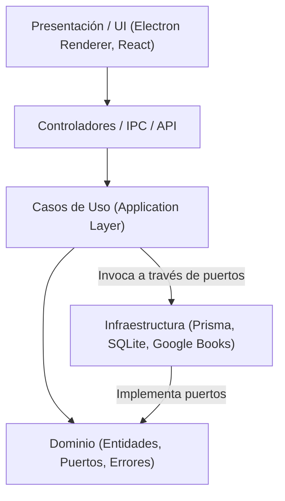
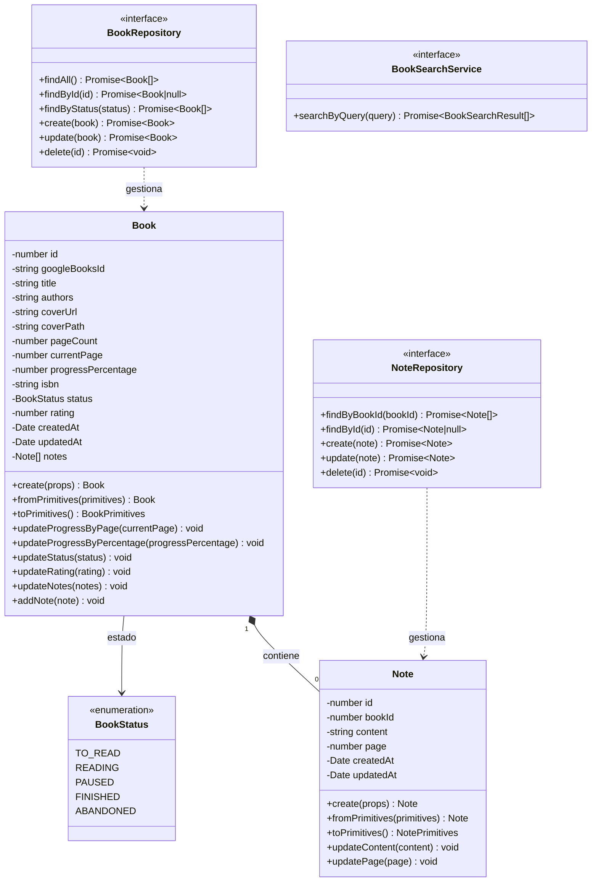

# Guía de Dominio en Clean Architecture: Entidades y Puertos

## 1. Introducción a la Capa de Dominio en BookLog

En Clean Architecture (y Arquitectura Hexagonal / Puertos y Adaptadores), la **Capa de Dominio** se ubica en el núcleo más interno del sistema de software. Su objetivo primordial es encapsular las **reglas de negocio fundamentales** y los **invariantes de dominio**, permaneciendo completamente agnóstica de frameworks externos, bibliotecas de persistencia (como Prisma u ORMs) y mecanismos de interfaz gráfica (como Electron o React).

### Reglas de Aislamiento del Dominio
- **Cero dependencias de infraestructura:** Ningún archivo dentro de `src/shared/domain/` importa `@prisma/client`, Node fs u otras APIs de runtime específicas.
- **Tipado estricto en TypeScript:** El dominio se expresa mediante clases, tipos y puertos puros de TypeScript con resolución de módulos ECMAScript (`.js`).
- **Encapsulación de invariantes:** Las entidades no son meras estructuras de datos anémicas; son objetos ricos con métodos de mutación que validan su estado en todo momento.

---

## 2. Entidades vs. Modelos de Persistencia

Uno de los antipatrones más frecuentes es usar directamente los tipos generados por el ORM (ej. modelos de Prisma) como objetos de negocio. BookLog establece una estricta separación:

| Dimensión | Entidad de Dominio (`Book`, `Note`) | Modelo de Persistencia (`Prisma.Book`, `Prisma.Note`) |
| :--- | :--- | :--- |
| **Ubicación** | `src/shared/domain/entities/` | Generado por `@prisma/client` |
| **Responsabilidad** | Validar reglas e invariantes del negocio | Mapear filas y columnas relacionales en SQLite |
| **Comportamiento** | Métodos ricos (`updateProgressByPage`, etc.) | Estructura anémica (POJO / DTO de base de datos) |
| **Evolución** | Cambia por necesidades funcionales del usuario | Cambia por optimizaciones de almacenamiento o esquema |

---

## 3. Diagrama de Clases del Dominio

---

## 4. Invariantes Clave de Negocio

### Sincronización Bidireccional de Progreso
- **Actualización por página (`currentPage`):**
  - Si el libro tiene `pageCount`, valida `0 <= currentPage <= pageCount`.
  - Calcula `progressPercentage = Math.round((currentPage / pageCount) * 100)`.
- **Actualización por porcentaje (`progressPercentage`):**
  - Valida `0 <= progressPercentage <= 100`.
  - Si el libro tiene `pageCount`, calcula `currentPage = Math.round((progressPercentage / 100) * pageCount)`.
- **Coherencia garantizada:** Ambos valores se mantienen sincronizados sin importar cuál de las dos vías invoque el usuario.

### Transición de Estados
- **Estado `FINISHED`:** Al marcar un libro como terminado, automáticamente se asigna `progressPercentage = 100` y `currentPage = pageCount` (si `pageCount` está definido).
- **Estado `TO_READ`:** Si un libro en curso o finalizado se vuelve a pasar a `TO_READ`, se **conservan** su última página leída y porcentaje alcanzado, permitiendo reactivar la lectura sin perder el histórico.

### Notas del Lector
- **Contenido obligatorio:** Se valida que el contenido tenga texto no vacío (`trimmed length > 0`).
- **Página de referencia opcional:** Si se indica una página para la nota, debe ser un entero válido $\ge 1$.

---

## 5. Puertos: Inversión de Dependencias (DIP)

Los **puertos** son interfaces definidas en el dominio (`src/shared/domain/ports/`):
- `BookRepository`: Contrato CRUD para la persistencia de libros.
- `NoteRepository`: Contrato CRUD para notas asociadas a libros.
- `BookSearchService`: Contrato para la búsqueda externa de metadatos (ej. Google Books API).

Los adaptadores de infraestructura (`src/shared/infrastructure/persistence/PrismaBookRepository.ts`, etc.) implementarán estos puertos en fases posteriores. De esta manera, el dominio nunca depende de la base de datos, sino que la base de datos depende de las abstracciones del dominio.
