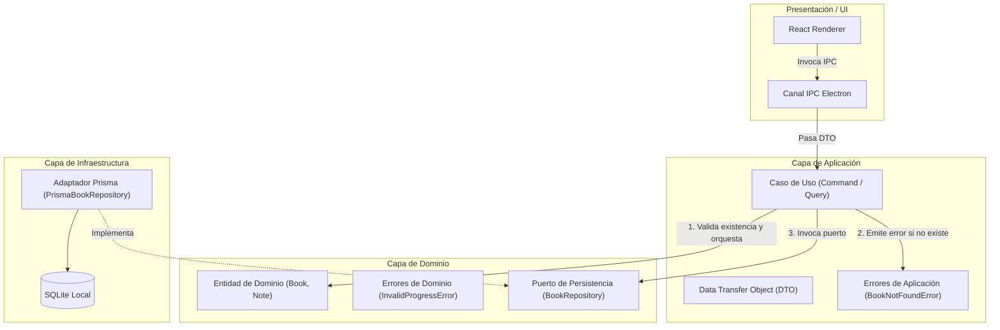
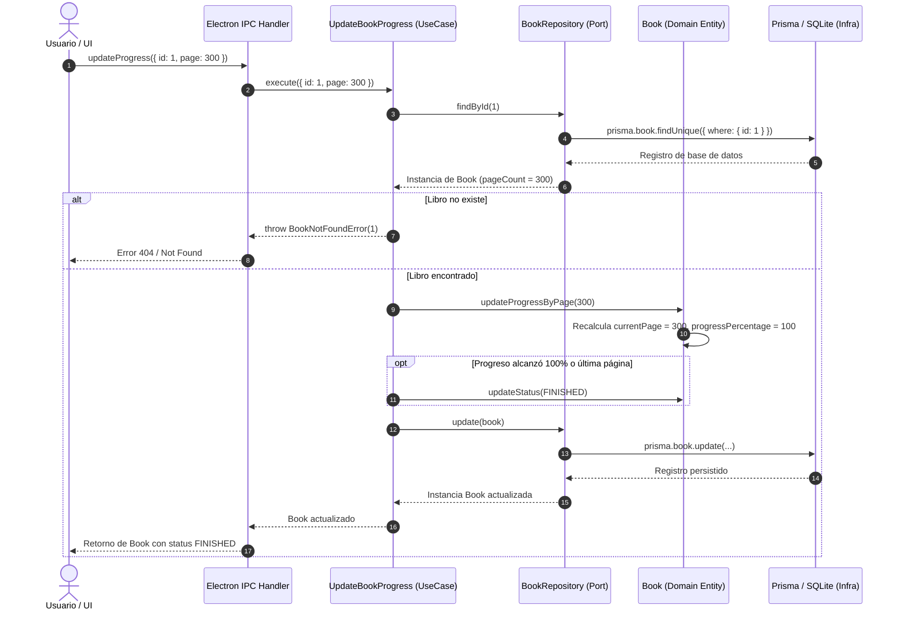

# Guía de la Capa de Aplicación en Clean Architecture: Casos de Uso

## 1. Introducción a la Capa de Aplicación

En Clean Architecture (y Arquitectura Hexagonal / Puertos y Adaptadores), la **Capa de Aplicación** (`src/shared/application/`) orquesta el flujo de datos hacia y desde las entidades de dominio, y dirige a dichas entidades para que apliquen sus reglas de negocio a fin de alcanzar los objetivos del caso de uso.

A diferencia del dominio (que contiene reglas que existen independientemente de cualquier aplicación informática particular), la capa de aplicación contiene las **reglas de negocio específicas de la aplicación** (application-specific business rules).



---

## 2. Flujo Arquitectónico: DTO $\to$ UseCase $\to$ Domain Entity $\to$ Repository Port

Cada caso de uso sigue un flujo estricto y predecible de cuatro etapas:

1. **Recepción del DTO (Data Transfer Object):**
   - El caso de uso recibe un objeto plano con tipos primitivos o enums (`AddBookDTO`, `UpdateBookProgressDTO`, etc.).
   - No recibe objetos acoplados a frameworks ni requests de red directos.

2. **Orquestación y Consulta:**
   - Si la operación requiere un registro preexistente (`UpdateBookStatus`, `UpdateBookProgress`, `RateBook`, `DeleteBook`), el caso de uso consulta el puerto de repositorio (`findById`).
   - Si no se encuentra, se interrumpe el flujo lanzando un error tipado de aplicación (`BookNotFoundError`).

3. **Ejecución de Lógica e Invariantes de Dominio:**
   - El caso de uso no realiza cálculos matemáticos de progreso ni valida estructuras internas de la entidad: le delega esa responsabilidad a los métodos ricos de la entidad (`Book.create`, `book.updateProgressByPage`, `book.updateProgressByPercentage`, `book.updateRating`).
   - Aplica políticas de aplicación transversales, como la **transición automática a FINISHED** cuando un libro alcanza el 100% de progreso o su página máxima.

4. **Persistencia mediante el Puerto (Inversión de Dependencias):**
   - La entidad modificada se entrega al puerto del repositorio (`bookRepository.create` o `bookRepository.update`).
   - El caso de uso no conoce ni le importa si el puerto está implementado por Prisma, un mock en memoria para pruebas o una API remota.

---

## 3. Diagrama de Secuencia: Actualización de Progreso (`UpdateBookProgress`)

El siguiente diagrama ilustra la interacción entre capas cuando el usuario registra avance de lectura:



---

## 4. Inyección de Dependencias y Testabilidad

### Principio de Inversión de Dependencias (DIP)

Los casos de uso dependen exclusivamente de interfaces abstractas (`BookRepository`), nunca de implementaciones concretas (`PrismaBookRepository`).

```typescript
export class UpdateBookStatus {
  constructor(private readonly bookRepository: BookRepository) {}

  public async execute(dto: UpdateBookStatusDTO): Promise<Book> {
    const book = await this.bookRepository.findById(dto.id)
    if (!book) {
      throw new BookNotFoundError(dto.id)
    }
    book.updateStatus(dto.status)
    return await this.bookRepository.update(book)
  }
}
```

### Ventajas de Testabilidad con Mocks en Memoria

Gracias a esta inversión, la suite de pruebas unitarias (`tests/application/test_book_use_cases.test.ts`) se ejecuta de manera ultrarrápida (en milisegundos) sin necesidad de tocar la base de datos de producción o levantar contenedores:

```typescript
class MockBookRepository implements BookRepository {
  public books: Map<number, Book> = new Map()
  // Implementación en memoria sin SQLite...
}

const mockRepo = new MockBookRepository()
const useCase = new UpdateBookProgress(mockRepo)
```

---

## 5. Errores de Dominio vs. Errores de Aplicación

| Tipo de Error | Ubicación | Ejemplo | Causa |
| :--- | :--- | :--- | :--- |
| **Dominio** | `src/shared/domain/errors/` | `InvalidBookError`, `InvalidProgressError` | Violación de un invariante intrínseco (página negativa, rating > 5, título vacío). |
| **Aplicación** | `src/shared/application/errors/` | `BookNotFoundError` | Un recurso solicitado por un caso de uso no existe en la persistencia del sistema. |
| **Infraestructura** | `src/shared/infrastructure/` | `PrismaClientKnownRequestError` | Fallo de conexión SQLite, disco lleno, timeout. |

Esta separación permite que las capas superiores (controladores IPC y UI) mapeen errores de forma idiomática, presentando mensajes claros y precisos al usuario final.
