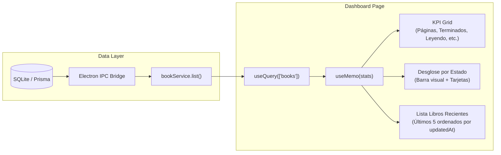
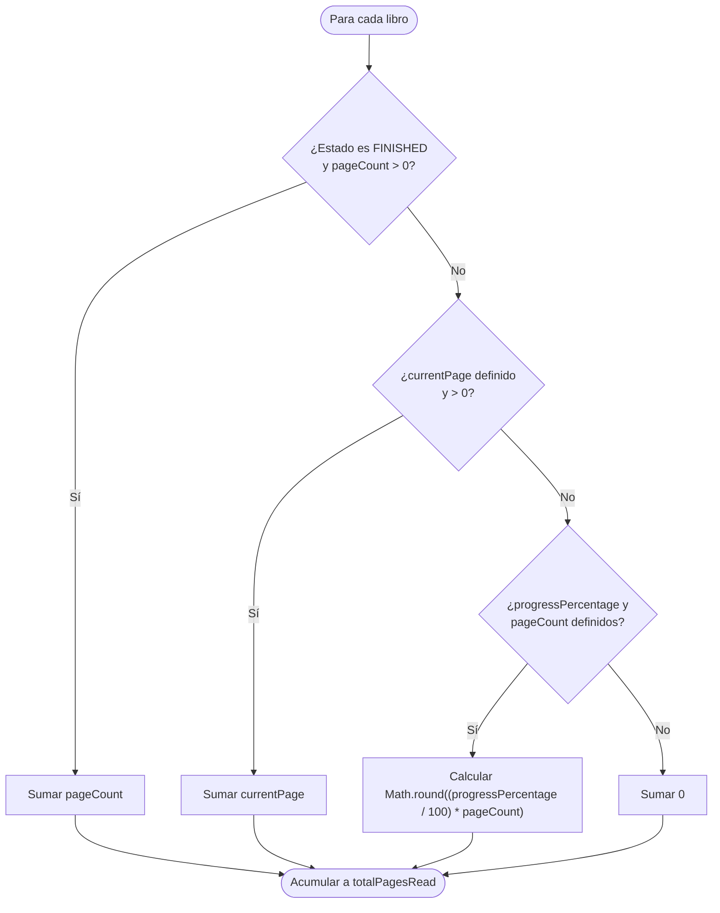

# Guía Técnica: Dashboard y Estadísticas de Lectura (`ui_dashboard_stats`)

Esta guía documenta la arquitectura, componentes, modelos de datos y flujo de cálculo de métricas para la vista de estadísticas de lectura (`DashboardPage`) en BookLog.

---

## 1. Arquitectura de Navegación y Vistas

El punto de entrada principal (`src/renderer/src/App.tsx`) expone un encabezado de navegación persistente que permite alternar entre la biblioteca de libros y el dashboard de hábitos de lectura.

```mermaid
flowchart TD
    App["App.tsx\nState: AppView"]
    Nav["Header Navigation\nTabs: Biblioteca / Dashboard"]
    LibPage["LibraryPage.tsx\n(Catálogo de libros y filtros)"]
    DashPage["DashboardPage.tsx\n(KPIs, desglose, libros recientes)"]
    DetailPage["BookDetailPage.tsx\n(Detalle, notas, edición)"]

    App --> Nav
    Nav -->|Selecciona Biblioteca| LibPage
    Nav -->|Selecciona Dashboard| DashPage
    LibPage -->|onSelectBook(id)| DetailPage
    DashPage -->|onSelectBook(id)| DetailPage
    DetailPage -->|onBack()| App
```

### Definición de Tipos de Vista

```typescript
export type AppView =
  | { type: 'library' }
  | { type: 'dashboard' }
  | { type: 'detail'; bookId: number }
```

La navegación preserva el origen (`previousView: 'library' | 'dashboard'`) de manera que volver desde el detalle de un libro devuelve al usuario exactamente a la vista desde donde inició la navegación.

---

## 2. Flujo de Datos y Jerarquía de Componentes

`DashboardPage` utiliza TanStack Query para consultar el catálogo completo mediante `bookService.list()` (sin filtros de estado) y computa en memoria de forma reactiva las métricas y los libros recientes.



---

## 3. Algoritmo de Cálculo de Páginas Totales Leídas

El cálculo del volumen de páginas leídas contempla múltiples escenarios de registro de progreso:



### Implementación del Cálculo

```typescript
export function calculateBookPagesRead(book: {
  status: BookStatus | string
  currentPage?: number | null
  progressPercentage?: number | null
  pageCount?: number | null
}): number {
  if (book.status === BookStatus.FINISHED && book.pageCount && book.pageCount > 0) {
    return book.pageCount
  }
  if (book.currentPage !== undefined && book.currentPage !== null && book.currentPage > 0) {
    return book.currentPage
  }
  if (
    book.progressPercentage !== undefined &&
    book.progressPercentage !== null &&
    book.progressPercentage > 0 &&
    book.pageCount &&
    book.pageCount > 0
  ) {
    return Math.round((book.progressPercentage / 100) * book.pageCount)
  }
  return 0
}
```

---

## 4. Clasificación y Formato de Libros Recientes

Para identificar lecturas activas y modificaciones recientes, la función `sortRecentBooks` ordena descendentemente por la marca temporal de actualización:

```typescript
export function sortRecentBooks(books: BookPrimitives[]): BookPrimitives[] {
  return [...books]
    .sort((a, b) => {
      const timeB = b.updatedAt
        ? new Date(b.updatedAt).getTime()
        : b.createdAt
          ? new Date(b.createdAt).getTime()
          : 0
      const timeA = a.updatedAt
        ? new Date(a.updatedAt).getTime()
        : a.createdAt
          ? new Date(a.createdAt).getTime()
          : 0
      return timeB - timeA
    })
    .slice(0, 5)
}
```

Cada tarjeta de libro reciente presenta:
- Miniatura de portada con resolución de URLs locales (`booklog-media://`), remotas o placeholder con icono `BookOpen`.
- Título y autor con recorte elíptico en pantallas pequeñas.
- Badge cromático por estado (`FINISHED`: Índigo, `READING`: Esmeralda, `PAUSED`: Ámbar, `TO_READ`: Cielo, `ABANDONED`: Rosa).
- Indicador visual y numérico de porcentaje de avance.
- Atributos de accesibilidad (`role="button"`, `tabIndex={0}`, navegación vía teclado `Enter` o `Espacio`).

---

## 5. Estados de Interfaz

1. **Cargando (`isLoading`):** Muestra spinner con indicador visual accesible `data-testid="loading-state"`.
2. **Error (`isError`):** Presenta mensaje de error específico con botón de reintento (`data-testid="retry-button"`).
3. **Biblioteca Vacía (`books.length === 0`):** Contenedor descriptivo invitando a agregar los primeros libros (`data-testid="empty-dashboard-state"`).
4. **Con Datos:** Despliega la cuadrícula de KPIs, desglose porcentual con barra de distribución y el listado de lecturas recientes.
