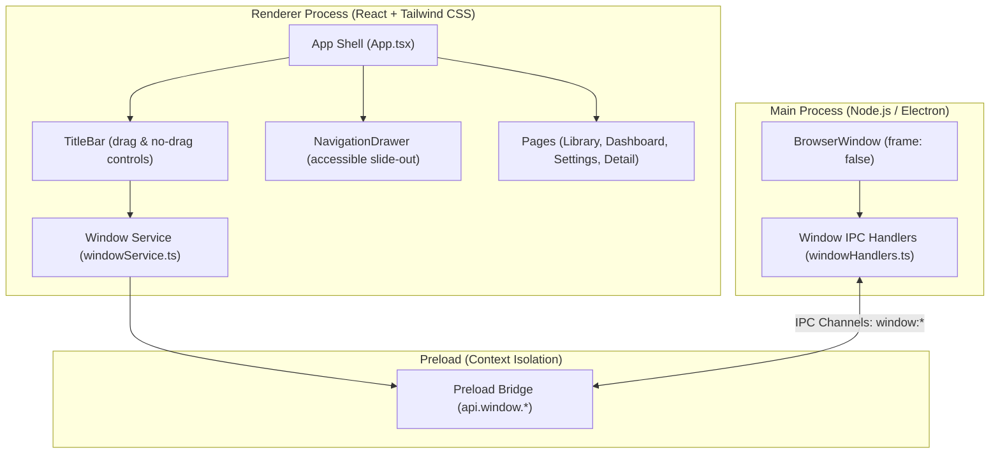
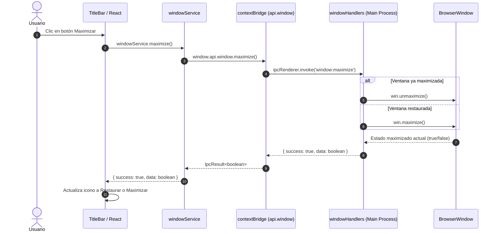

# Guía de Arquitectura: Titlebar Personalizada, Control de Ventana Frameless y Navegación React

Esta guía técnica describe el diseño, la implementación y las medidas de seguridad para la ventana frameless nativa, la barra de título (`TitleBar`), el control de ventana vía IPC seguro y el menú lateral accesible (`NavigationDrawer`) en BookLog.

---

## 1. Arquitectura General del Shell

En Electron, las aplicaciones modernas suelen prescindir del marco estándar del sistema operativo (`frame: false`) para ofrecer una interfaz unificada, oscura y personalizada que coincida con el diseño de la aplicación.



---

## 2. Ventana Frameless y Drag Regions

### 2.1 Configuración en Main Process

Para activar el modo frameless, se configura el objeto `BrowserWindow` en `src/main/index.ts`:

```typescript
const mainWindow = new BrowserWindow({
  width: 900,
  height: 670,
  show: false,
  frame: false, // Oculta marco y barra nativa del sistema operativo
  autoHideMenuBar: true,
  webPreferences: {
    preload: join(__dirname, '../preload/index.js'),
    sandbox: false
  }
})
```

### 2.2 Zonas de Arrastre (`-webkit-app-region`)

En una ventana frameless, el usuario debe poder mover la ventana arrastrando la barra superior. Sin embargo, los botones dentro de dicha barra (minimizar, maximizar, cerrar y menú hamburguesa) deben seguir respondiendo a los eventos del ratón:

- **Contenedor TitleBar**: `style={{ WebkitAppRegion: 'drag' }}` permite arrastrar la ventana en cualquier parte vacía de la barra.
- **Elementos Interactivos**: Cualquier botón, enlace o campo interactivo debe especificar `style={{ WebkitAppRegion: 'no-drag' }}` para que el motor Chromium transmita los clics al DOM en lugar de interpretarlos como arrastre de ventana.

```tsx
<div
  className="h-9 bg-slate-950 flex items-center justify-between"
  style={{ WebkitAppRegion: 'drag' } as React.CSSProperties}
>
  <div style={{ WebkitAppRegion: 'no-drag' } as React.CSSProperties}>
    <button onClick={onToggleMenu}>Menú</button>
  </div>
  
  <div className="flex-1" />

  <div style={{ WebkitAppRegion: 'no-drag' } as React.CSSProperties}>
    <button onClick={handleMinimize}>_</button>
    <button onClick={handleMaximize}>[ ]</button>
    <button onClick={handleClose}>X</button>
  </div>
</div>
```

---

## 3. Seguridad IPC y Control de Ventana

El proceso renderer nunca interactúa de forma directa con APIs del sistema de Node.js o Electron. Todo comando de ventana pasa por el puente seguro de IPC:



### Canales IPC Definidos

- `window:minimize`: Invoca `win.minimize()`, retorna `IpcResult<void>`.
- `window:maximize`: Si la ventana está maximizada llama a `unmaximize()`, de lo contrario a `maximize()`. Retorna `IpcResult<boolean>` con el nuevo estado.
- `window:close`: Invoca `win.close()`, retorna `IpcResult<void>`.
- `window:isMaximized`: Consulta el estado actual con `win.isMaximized()`, retorna `IpcResult<boolean>`.

---

## 4. Drawer de Navegación Lateral (`NavigationDrawer`)

El `NavigationDrawer` se activa mediante el botón hamburguesa (`Menu`) ubicado a la izquierda de la `TitleBar`.

### Características de Accesibilidad (a11y)
1. **Modal accesible**: Cuenta con atributos ARIA `role="dialog"`, `aria-modal="true"` y `aria-label`.
2. **Cierre contextual**:
   - Presionar la tecla `Escape` (escucha global en `window` durante el ciclo de vida visible).
   - Clic en el backdrop oscuro semitransparente.
   - Clic en el botón explícito de cierre (`X`).
   - Selección de cualquiera de las rutas de navegación (`Dashboard`, `Biblioteca`, `Configuración`).
3. **Indicador de ruta activa**: Cada opción muestra resaltado cromático (borde e indicador índigo) cuando coincide con `currentView`.

---

## 5. Enrutamiento y Preservación de Historial Contextual

En `App.tsx`, el estado de la vista se define con el tipo discriminado:

```typescript
export type AppView =
  | { type: 'library' }
  | { type: 'dashboard' }
  | { type: 'settings' }
  | { type: 'detail'; bookId: number }
```

### Regla de Retorno Contextual (`previousView`)
Cuando el usuario selecciona un libro desde la `Biblioteca` o desde el `Dashboard`, `App` almacena la vista de origen:

```typescript
const handleSelectBook = (bookId: number): void => {
  if (view.type === 'library' || view.type === 'dashboard' || view.type === 'settings') {
    setPreviousView(view.type)
  }
  setView({ type: 'detail', bookId })
}

const handleBackFromDetail = (): void => {
  setView({ type: previousView })
}
```

De este modo, si el usuario exploraba el `Dashboard` y abre una ficha de libro reciente, al pulsar "Volver" retornará al `Dashboard` y no forzosamente a la `Biblioteca`.
