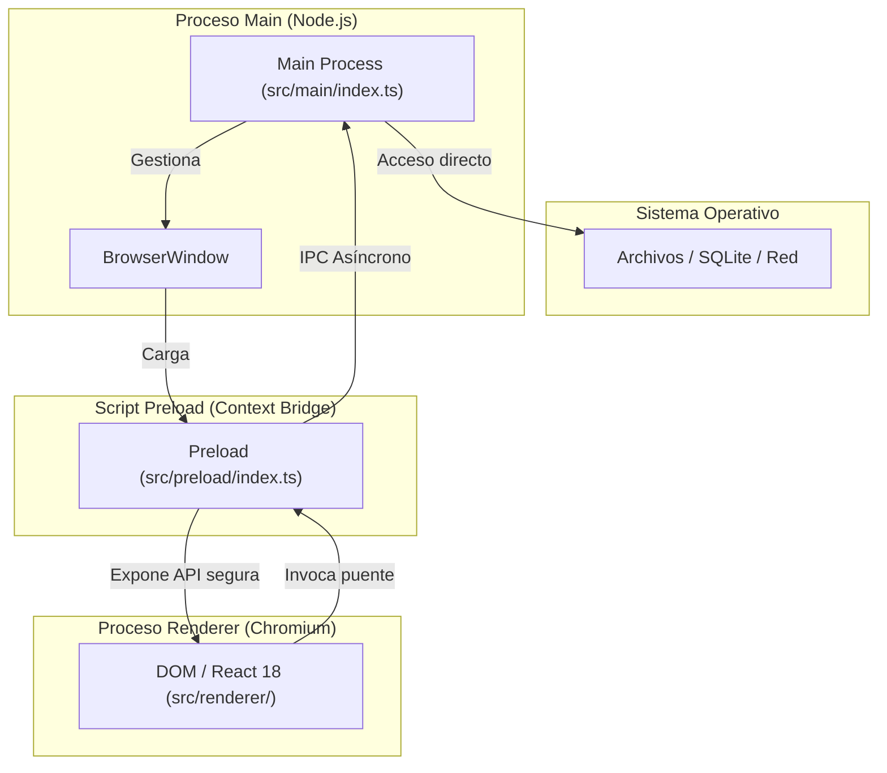
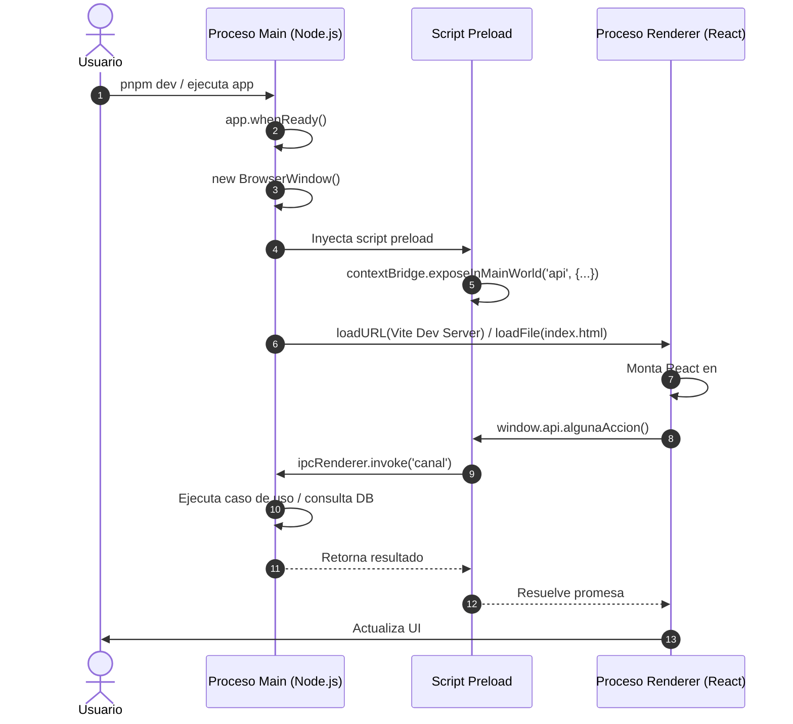

# Fundamentos de Electron: Procesos, Aislamiento y Ciclo de Vida

> Guía conceptual para entender la arquitectura de BookLog basada en Electron, Vite y React.

---

## 1. El modelo multi-proceso de Electron

Electron combina dos tecnologías fundamentales:
- **Chromium**: Se encarga del renderizado de la interfaz visual (HTML, CSS, JavaScript).
- **Node.js**: Proporciona acceso al sistema operativo de bajo nivel (archivos, procesos, base de datos).

Para garantizar estabilidad y seguridad, Electron no ejecuta todo en un único hilo. En su lugar, utiliza un modelo multi-proceso:

---

## 2. Los tres componentes clave

### A. Proceso Main (`src/main/`)
- Es el punto de entrada de la aplicación (`src/main/index.ts`).
- Se ejecuta en un entorno **puro de Node.js**.
- Controla el ciclo de vida de la aplicación (`app.whenReady()`, `app.on('window-all-closed')`).
- Crea y administra las instancias de `BrowserWindow`.
- Aquí residirá el acceso a la base de datos (Prisma + SQLite) y las llamadas directas al sistema operativo.

### B. Proceso Renderer (`src/renderer/`)
- Cada ventana abierta por Electron ejecuta su propio proceso de renderizado.
- Se ejecuta dentro del motor de Chromium, igual que una página web moderna.
- En nuestro proyecto, corre **React 18** empaquetado con **Vite** y estilizado con **Tailwind CSS v4**.
- Por motivos de seguridad (`contextIsolation: true`, `nodeIntegration: false`), **no tiene acceso directo a Node.js ni al sistema de archivos**.

### C. Script Preload (`src/preload/`)
- Se ejecuta antes de que se cargue el código del Renderer en la ventana.
- Tiene acceso tanto a APIs de Node/Electron como al objeto `window` del DOM.
- Actúa como una aduana de seguridad: mediante `contextBridge.exposeInMainWorld`, expone únicamente las funciones necesarias al Renderer, evitando que código malicioso del frontend pueda ejecutar comandos en el sistema operativo.

---

## 3. Secuencia de inicio y comunicación

---

## 4. Por qué Clean Architecture en Electron

Al desarrollar aplicaciones de escritorio con Electron, es común caer en el error de mezclar APIs de Electron (`ipcRenderer`, `ipcMain`) en los componentes de React o en la lógica de negocio.

En BookLog mantenemos una separación estricta:
1. **El Renderer solo conoce contratos de servicios** (`src/renderer/src/services/`). No sabe si la información viene de IPC, REST o WebSockets.
2. **El Dominio (`src/shared/domain/`) es JavaScript/TypeScript puro**. No importa nada de Electron, React ni Prisma.
3. **La Aplicación (`src/shared/application/`) orquesta casos de uso**.
4. **La Infraestructura (`src/shared/infrastructure/`) implementa los puertos**. Si el día de mañana se migra la aplicación a la web, el Dominio y los Casos de Uso se reutilizan al 100%.
