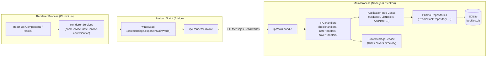
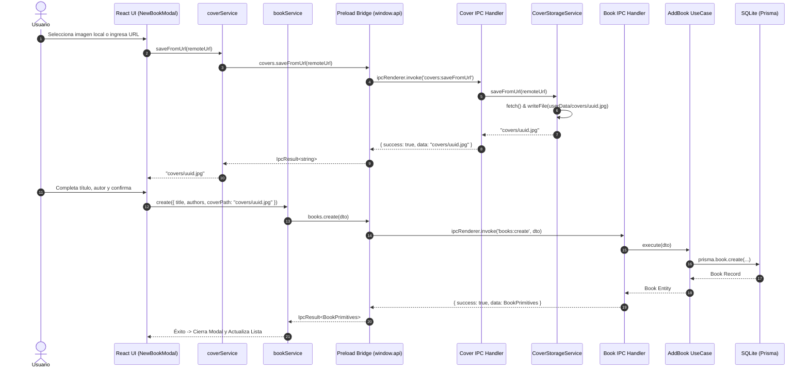
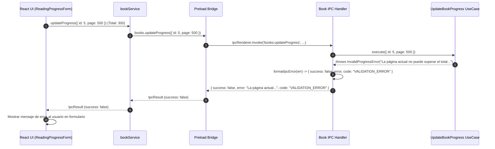

# Arquitectura IPC en Electron: Puente Tipado, Protocolos Seguros y Patrón Result

## 1. Introducción y Modelo de Procesos en Electron

Electron divide la ejecución de una aplicación en dos tipos de procesos fundamentales con límites de seguridad y responsabilidades muy distintas:
1. **Proceso Principal (`Main Process`):**
   - Ejecuta Node.js completo.
   - Tiene acceso al sistema de archivos, ciclo de vida de la aplicación, base de datos SQLite con Prisma y APIs nativas del sistema operativo.
2. **Proceso de Renderizado (`Renderer Process`):**
   - Ejecuta Chromium para mostrar la interfaz web (React, HTML, CSS).
   - Por motivos de seguridad (`contextIsolation: true`, `nodeIntegration: false`), no tiene acceso directo a Node.js ni a la base de datos.
3. **Script de Preload (`Preload Script`):**
   - Se ejecuta en un contexto privilegiado antes de que cargue el DOM del Renderer.
   - Actúa como el puente seguro entre ambos mundos utilizando `contextBridge` e `ipcRenderer`.



---

## 2. Seguridad en Electron: `contextBridge` y Canal Tipado

Para evitar vulnerabilidades de Remote Code Execution (RCE) o fugas de APIs privilegiadas de Node.js al contexto del navegador:
1. **Nunca exponer módulos directos de Node.js ni `ipcRenderer` sin filtrar:**
   Si se expone `ipcRenderer` crudo en `window`, cualquier script o vulnerabilidad XSS podría enviar mensajes a canales arbitrarios del Main process.
2. **Superficie de Ataque Mínima con Métodos Explícitos:**
   En `src/preload/index.ts`, cada método expuesto encapsula exactamente el canal correspondiente:
   ```typescript
   export const api = {
     books: {
       list: (dto?: ListBooksDTO) => ipcRenderer.invoke(IPC_CHANNELS.BOOKS.LIST, dto),
       getById: (id: number) => ipcRenderer.invoke(IPC_CHANNELS.BOOKS.GET_BY_ID, { id }),
       create: (dto: AddBookDTO) => ipcRenderer.invoke(IPC_CHANNELS.BOOKS.CREATE, dto),
       // ...
     }
   }
   ```
3. **Aislamiento de Contexto (`contextIsolation: true`):**
   Garantiza que el prototipo de objetos en el Renderer no pueda contaminar o acceder al entorno de ejecución del script de Preload.

---

## 3. Patrón Result: Manejo Resiliente de Errores IPC

En aplicaciones tradicionales, una excepción no capturada en `ipcMain.handle` rechaza la promesa en el Renderer con un `Error` genérico serializado. Esto provoca dos problemas:
- La pérdida del tipo de error concreto (ej: `BookNotFoundError`).
- La necesidad de rodear cada llamada en el Renderer con bloques `try/catch`.

### Definición del Contrato `IpcResult<T>`
En `src/shared/infrastructure/ipc/contracts.ts`:
```typescript
export type IpcResult<T> =
  | { success: true; data: T }
  | { success: false; error: string; code?: string }
```

### Formateo Centralizado de Errores en Main
Cuando un caso de uso lanza una excepción de dominio o aplicación, `formatIpcError` traduce la excepción a un código estándar:
```typescript
export function formatIpcError(err: unknown): { success: false; error: string; code: string } {
  if (err instanceof BookNotFoundError) {
    return { success: false, error: err.message, code: IPC_ERROR_CODES.BOOK_NOT_FOUND }
  }
  if (err instanceof NoteNotFoundError) {
    return { success: false, error: err.message, code: IPC_ERROR_CODES.NOTE_NOT_FOUND }
  }
  if (err instanceof DomainError) {
    return { success: false, error: err.message, code: IPC_ERROR_CODES.VALIDATION_ERROR }
  }
  if (err instanceof Error) {
    return { success: false, error: err.message, code: IPC_ERROR_CODES.INTERNAL_ERROR }
  }
  return { success: false, error: String(err), code: IPC_ERROR_CODES.INTERNAL_ERROR }
}
```

### Consumo Discriminado en el Renderer
```typescript
const result = await bookService.getById(bookId)

if (!result.success) {
  if (result.code === 'BOOK_NOT_FOUND') {
    // Manejar caso libro no encontrado (redireccionar, mostrar 404)
  } else {
    // Mostrar notificación toast de error
    console.error(result.error)
  }
  return
}

// Aquí TypeScript garantiza que result.data existe y es BookPrimitives
const book = result.data
```

---

## 4. Almacenamiento Local de Portadas y Protocolo Seguro `booklog-media://`

BookLog está diseñado bajo una filosofía **Offline-First**. Las portadas de los libros deben poder verse sin conexión a internet y sin recargar la base de datos con imágenes pesadas.

### Estrategia de Almacenamiento
1. Cuando el usuario ingresa un libro con portada (desde Google Books o un archivo local):
   - Se invoca `covers:saveFromUrl` o `covers:saveFromLocal`.
   - `CoverStorageService` guarda el archivo en `app.getPath('userData')/covers/<uuid>.<ext>`.
   - Devuelve la ruta relativa persistible en base de datos: `covers/<uuid>.<ext>`.

### El Protocolo `booklog-media://`
Chromium bloquea por política de seguridad el acceso a esquemas `file://` desde páginas servidas por protocolos web o vite. Para resolverlo sin desactivar `webSecurity`:
1. **Registro Privilegiado:** Se registra el esquema `booklog-media` antes de que la aplicación esté lista (`app.whenReady()`):
   ```typescript
   protocol.registerSchemesAsPrivileged([
     {
       scheme: 'booklog-media',
       privileges: {
         standard: true,
         secure: true,
         supportFetchAPI: true,
         corsEnabled: true,
         stream: true
       }
     }
   ])
   ```
2. **Handler Seguro:** Se configura `protocol.handle('booklog-media', ...)`:
   - Se valida y sanitiza la ruta para evitar path traversal (`..`).
   - Se comprueba que el destino esté estrictamente dentro de `app.getPath('userData')`.
   - Se sirve el archivo mediante `net.fetch(pathToFileURL(fullPath).toString())`, aprovechando el streaming de Chromium, cabeceras MIME automáticas y soporte de caché.

### Helper de Resolución en el Renderer (`resolveCoverUrl`)
El helper `resolveCoverUrl` asegura que la etiqueta `` reciba siempre una URL válida:
- Si es una URL externa (`https://...`): se mantiene intacta.
- Si es una ruta relativa local (`covers/abc.jpg` o `abc.jpg`): se transforma en `booklog-media://covers/abc.jpg`.
- Si es nulo o vacío: devuelve la imagen de respaldo por defecto (fallback placeholder).

---

## 5. Diagramas de Secuencia

### Flujo Completo: Creación de Libro y Almacenamiento de Portada



### Flujo: Manejo de Excepción de Dominio en Actualización


