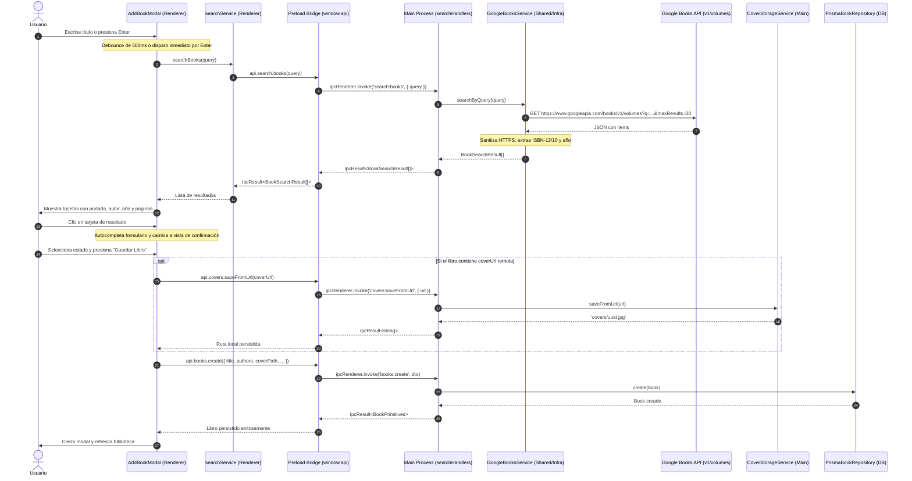

# Integración con APIs Externas: Google Books en BookLog

Esta guía técnica explica la arquitectura, el diseño y las decisiones implementadas para consumir APIs externas (Google Books API) en una aplicación de escritorio con Electron, Clean Architecture y React.

---

## 1. Arquitectura Hexagonal y Puertos

En Clean Architecture, el núcleo de la aplicación (dominio y casos de uso) nunca debe depender de implementaciones tecnológicas concretas ni de servicios web de terceros.

### Puerto de Búsqueda (`src/shared/domain/ports/BookSearchService.ts`)
El dominio define únicamente la interfaz abstracta que necesita:

```typescript
export interface BookSearchResult {
  googleBooksId?: string | null
  title: string
  authors: string[]
  description?: string | null
  publisher?: string | null
  publishedDate?: string | null
  pageCount?: number | null
  coverUrl?: string | null
  isbn?: string | null
}

export interface BookSearchService {
  searchByQuery(query: string): Promise<BookSearchResult[]>
}
```

### Adaptador de Infraestructura (`src/shared/infrastructure/api/GoogleBooksService.ts`)
La infraestructura provee la implementación concreta que interactúa con la API REST de Google Books:

```
[ Domain: BookSearchService ] <--- implements --- [ Infrastructure: GoogleBooksService ]
                                                           |
                                                        (HTTP)
                                                           v
                                                [ Google Books REST API ]
```

---

## 2. Flujo Completo de Búsqueda y Persistencia Offline

El siguiente diagrama de secuencia ilustra la interacción entre el usuario, el modal de React, la capa IPC, el servicio de Google Books y el almacenamiento local:



---

## 3. Sanitización y Transformación de Datos

Las respuestas de la API pública de Google Books pueden contener valores nulos, esquemas `http://` inseguros o formatos de fecha variables. `GoogleBooksService` aplica reglas estrictas:

1. **Forzado de HTTPS en Portadas:**
   Google Books habitualmente retorna URLs con protocolo `http://books.google.com/...`. Todas las URLs se sanitizan reemplazando `http://` por `https://` para evitar advertencias de contenido mixto y asegurar conexiones cifradas.
2. **Preferencia de Resolución de Portadas:**
   Se utiliza prioritariamente `imageLinks.thumbnail`; si no está presente, se recurre a `imageLinks.smallThumbnail`.
3. **Extracción Prioritaria de ISBN:**
   Se examina `industryIdentifiers` buscando primero el estándar moderno `ISBN_13`. Si no existe, se utiliza `ISBN_10` como alternativa de respaldo.
4. **Normalización de Fechas a Años de 4 Dígitos:**
   Google Books puede devolver fechas en formato `YYYY-MM-DD`, `YYYY-MM` o `YYYY`. Se extrae mediante expresión regular el año de 4 dígitos para visualización consistente en las tarjetas.
5. **Manejo Defensivo de Autores:**
   Si el campo `authors` viene indefinido o no es un arreglo, se devuelve una lista vacía `[]`, previniendo errores de tiempo de ejecución.

---

## 4. Patrones de Experiencia de Usuario (UX)

### Debounce y Disparo Inmediato
- Al tipear en el buscador, un temporizador de 500ms retrasa la petición de red para no saturar la API ni emitir peticiones por cada tecla pulsada.
- Si el usuario presiona la tecla `Enter` o hace clic en el botón "Buscar", se cancela cualquier temporizador pendiente y se dispara la búsqueda de forma inmediata.
- Las consultas con menos de 3 caracteres no ejecutan peticiones de red y muestran una guía amigable.

### Prevención de Condiciones de Carrera (*Race Conditions*)
En aplicaciones interactivas, una petición anterior más lenta podría resolver después de una petición posterior más rápida. Para evitar que resultados obsoletos sobreescriban la pantalla, se mantiene una referencia mutable `searchRequestIdRef`:

```typescript
const requestId = ++searchRequestIdRef.current
const res = await searchService.searchBooks(trimmed)
if (requestId !== searchRequestIdRef.current) {
  return // Se descarta el resultado porque hay una búsqueda más nueva en curso
}
```

### Transición hacia Confirmación y Persistencia Offline-First
Cuando el usuario selecciona un libro:
1. El modal autocompleta todos los campos disponibles (`title`, `authors`, `pageCount`, `isbn`, `coverUrl`, `googleBooksId`).
2. Se activa automáticamente la pestaña de formulario manual, permitiendo al usuario revisar y editar cualquier dato antes de guardar.
3. Se muestra un banner informativo que confirma que los datos fueron precargados desde Google Books.
4. Al confirmar el guardado, la portada se descarga físicamente a la carpeta local de BookLog (`userData/covers/`), garantizando que la portada seguirá disponible aun cuando la aplicación no tenga conexión a internet.
