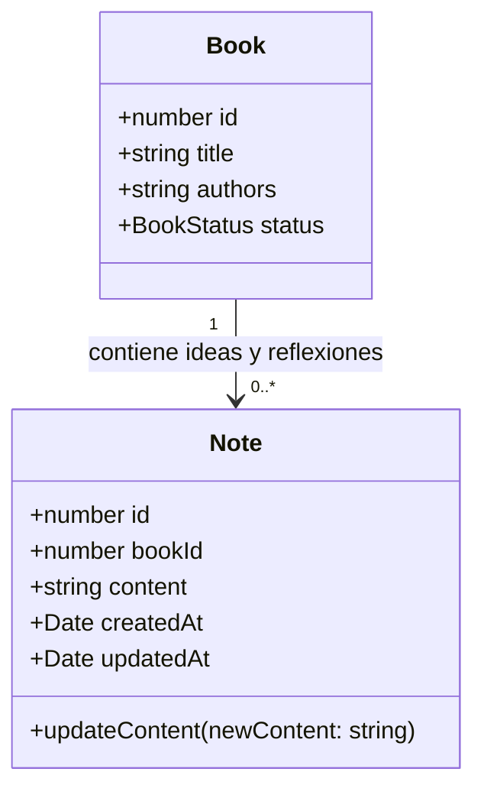
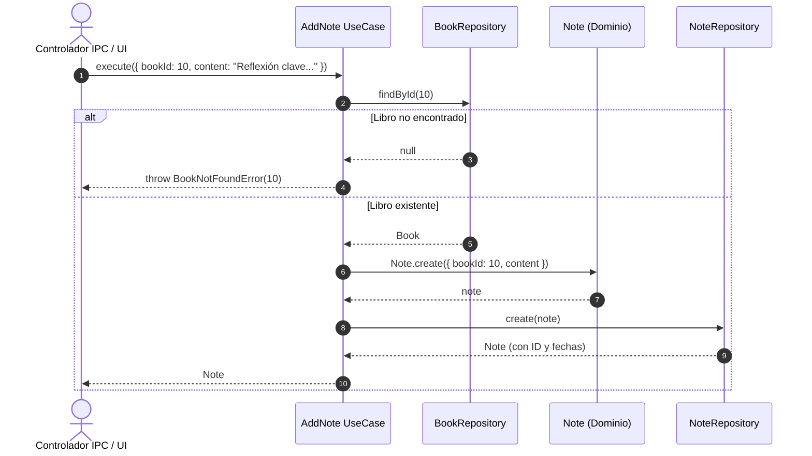
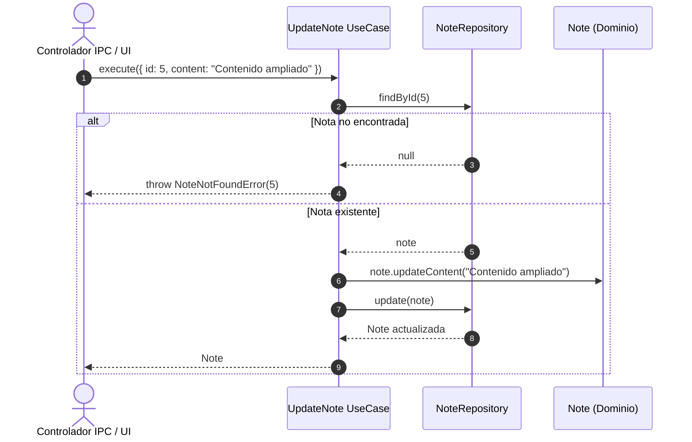

# Guía Técnica: Casos de Uso de Notas y Reflexiones de Lectura

Esta guía documenta la arquitectura, diseño conceptual y uso técnico de los casos de uso del módulo de **Notas** (`Note`) en BookLog.

---

## 1. Concepto de Nota en BookLog

A diferencia de marcadores o citas ancladas a una página física determinada, en BookLog una **Nota** se define conceptualmente como una **idea, pensamiento o reflexión personal** que el lector formula en torno a una obra.

Por esta razón:
- **Sin número de página (`page`):** La nota pertenece al libro en su totalidad (`bookId`), no a una página específica. Puede ser un aprendizaje global, un resumen conceptual o una conexión con otras lecturas.
- **Contenido significativo:** El cuerpo de la nota (`content`) es obligatorio y no puede consistir únicamente en espacios en blanco.
- **Trazabilidad temporal:** Toda nota registra su fecha de creación (`createdAt`) y su fecha de última modificación (`updatedAt`).



---

## 2. Casos de Uso Disponibles

Los casos de uso residen en `src/shared/application/use-cases/` y exponen una interfaz consistente basada en métodos `execute(dto)`:

| Caso de Uso | DTO de Entrada | Retorno | Validaciones Principales |
| :--- | :--- | :--- | :--- |
| **`AddNote`** | `{ bookId: number, content: string }` | `Promise<Note>` | Libro debe existir (`BookNotFoundError`). `content` no vacío (`InvalidNoteError`). |
| **`GetBookNotes`** | `{ bookId: number }` | `Promise<Note[]>` | Libro debe existir (`BookNotFoundError`). Retorna ordenadas por `createdAt ASC`. |
| **`UpdateNote`** | `{ id: number, content: string }` | `Promise<Note>` | Nota debe existir (`NoteNotFoundError`). `content` no vacío (`InvalidNoteError`). |
| **`DeleteNote`** | `{ id: number }` | `Promise<void>` | Nota debe existir (`NoteNotFoundError`). |

---

## 3. Flujos de Secuencia

### 3.1. Creación de una Nota (`AddNote`)

El caso de uso valida la existencia previa del libro antes de intentar persistir la nota:



### 3.2. Actualización de Contenido (`UpdateNote`)



---

## 4. Ejemplos de Integración

### Crear una nueva nota
```typescript
import { AddNote } from '../application/index.js'

const addNote = new AddNote(bookRepository, noteRepository)

try {
  const newNote = await addNote.execute({
    bookId: 1,
    content: 'La ley de Conway explica cómo la estructura organizacional moldea la arquitectura del software.'
  })
  console.log(`Nota guardada con ID ${newNote.id}`)
} catch (error) {
  if (error instanceof BookNotFoundError) {
    console.error(`El libro solicitado no existe: ${error.message}`)
  }
}
```

### Obtener las reflexiones de un libro
```typescript
import { GetBookNotes } from '../application/index.js'

const getBookNotes = new GetBookNotes(bookRepository, noteRepository)

const notes = await getBookNotes.execute({ bookId: 1 })
notes.forEach((note) => {
  console.log(`- [${note.createdAt.toISOString()}]: ${note.content}`)
})
```

---

## 5. Pruebas Unitarias y Mocks

La capa de aplicación no interactúa directamente con SQLite ni con Prisma. Todos los casos de uso se prueban de manera aislada utilizando mocks en memoria de los puertos `BookRepository` y `NoteRepository`:

```typescript
// tests/application/test_note_use_cases.test.ts
const bookRepo = new MockBookRepository()
const noteRepo = new MockNoteRepository()
const addNote = new AddNote(bookRepo, noteRepo)

const result = await addNote.execute({
  bookId: existingBook.id!,
  content: 'Idea de lectura'
})

expect(result.id).toBeDefined()
expect(result.content).toBe('Idea de lectura')
```
