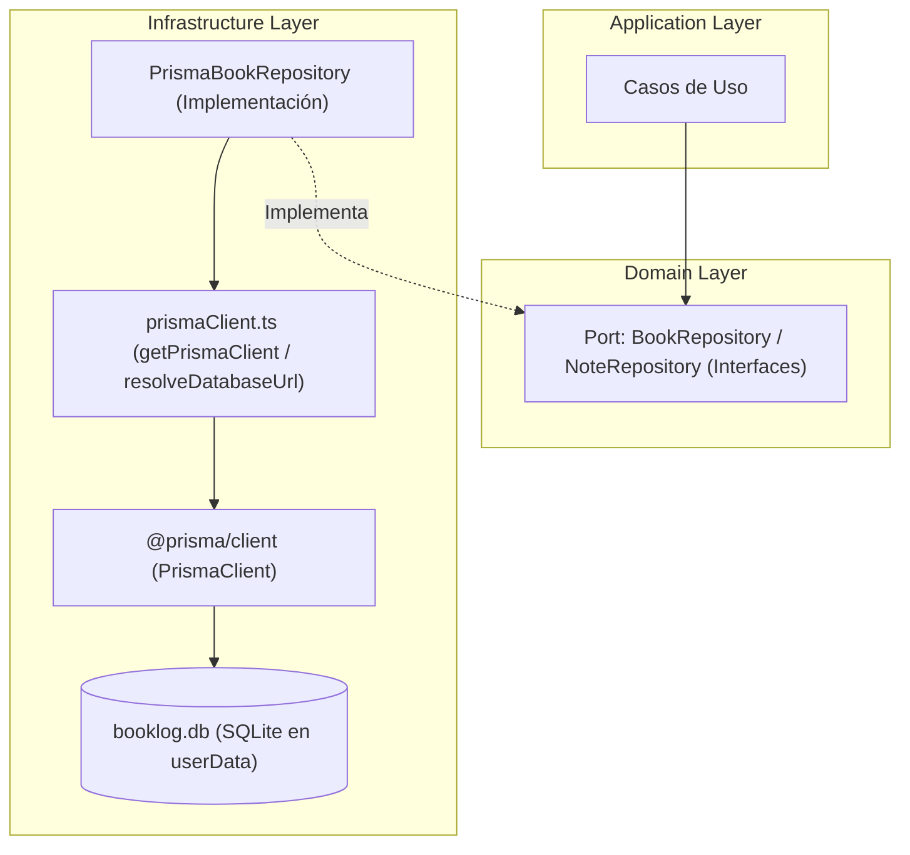
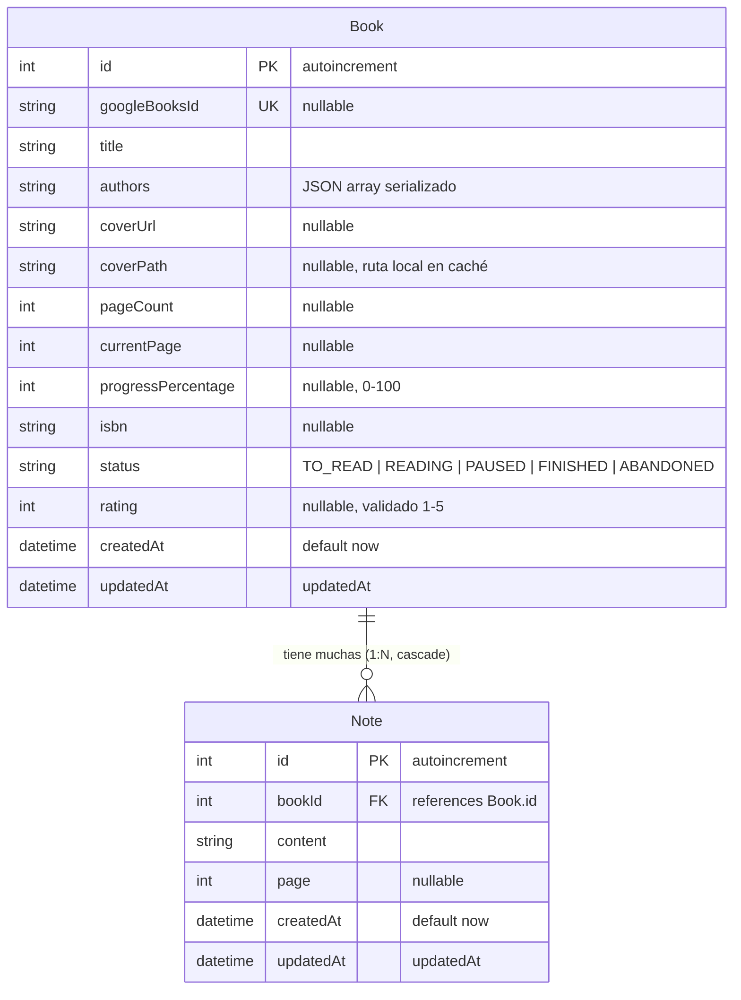
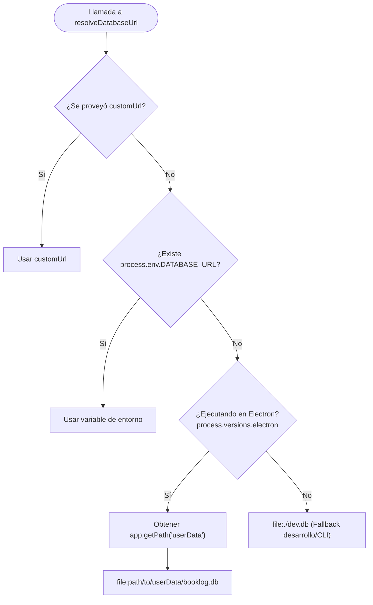

# Configuración de Prisma y SQLite en Electron

> Guía conceptual para la integración y ciclo de vida de persistencia en BookLog utilizando Prisma ORM y SQLite en un entorno de escritorio con Electron y Clean Architecture.

---

## 1. Arquitectura de Persistencia y Clean Architecture

En BookLog, la persistencia de datos se concibe como un detalle de implementación ubicado en la capa de **Infraestructura** (`src/shared/infrastructure/persistence/`). Las reglas de negocio y los casos de uso (`src/shared/domain/` y `src/shared/application/`) no tienen conocimiento directo de Prisma ni de SQLite.



---

## 2. Modelo Entidad-Relación (ER)

El esquema relacional define dos entidades principales: `Book` y `Note`, con integridad referencial y eliminación en cascada (`ON DELETE CASCADE`).



### Características del Modelo:
- **`BookStatus`**: Emulado mediante enum en Prisma (`TO_READ`, `READING`, `PAUSED`, `FINISHED`, `ABANDONED`) con valor por defecto `TO_READ`.
- **`authors`**: Almacenado como texto serializado (ejemplo: formato JSON `["Autor A", "Autor B"]`) para simplificar la persistencia sin requerir tablas de unión N:M en una app monousuario local.
- **`googleBooksId`**: Índice único (`@unique`) que previene duplicados al importar metadatos desde la API de Google Books.
- **`coverPath`**: Ruta en el almacenamiento local (`userData/covers/`) que respalda la imagen de portada para un funcionamiento 100% offline-first.
- **`currentPage` y `progressPercentage`**: Permiten un seguimiento flexible del avance de la lectura, ya sea por número de página leído o por porcentaje directo (0-100).
- **`Note`**: Notas y reflexiones asociadas a un libro con referencia opcional a número de página (`page`). Al eliminar un libro, todas sus notas asociadas se eliminan en cascada automáticamente (`ON DELETE CASCADE`).

---

## 3. Ciclo de Vida de la Base de Datos en Electron

En una aplicación de escritorio, la base de datos SQLite no puede residir dentro del directorio del código empaquetado (e.g. `resources/app.asar`), ya que este es de sólo lectura una vez instalada la aplicación.

Por ende, el archivo de base de datos se almacena en el directorio `userData` que el sistema operativo asigna para la aplicación:
- **Windows**: `%APPDATA%\BookLog\booklog.db`
- **macOS**: `~/Library/Application Support/BookLog/booklog.db`
- **Linux**: `~/.config/BookLog/booklog.db`

### Resolución Dinámica de la Conexión

La función `resolveDatabaseUrl` en `src/shared/infrastructure/persistence/prismaClient.ts` aplica una jerarquía estricta:



---

## 4. Estrategia de Aislamiento para Tests

Para garantizar el cumplimiento de la regla de no alterar ni borrar jamás los datos reales del usuario ni bases de datos de desarrollo:

1. Los tests de infraestructura (`tests/infrastructure/test_prisma_connection.test.ts`) generan bases de datos temporales únicas en el directorio temporal del sistema operativo (`os.tmpdir()`).
2. Se instancia un `PrismaClient` apuntando exclusivamente a esa URL temporal (`file:${tempDbPath}`).
3. Se ejecutan dinámicamente y en orden todas las sentencias DDL de las migraciones existentes (`prisma/migrations/**/migration.sql`) y se activa `PRAGMA foreign_keys = ON;`.
4. Al finalizar la suite (`afterAll`), el cliente se desconecta y los archivos temporales (`.db` y `.db-journal`) se eliminan.

---

## 5. Comandos de Mantenimiento de Prisma

- Generar tipos del cliente:
  ```bash
  pnpm prisma generate
  ```
- Crear y aplicar nueva migración en desarrollo:
  ```bash
  pnpm prisma migrate dev --name <nombre_migracion>
  ```
- Inspeccionar la base de datos visualmente:
  ```bash
  pnpm prisma studio
  ```
