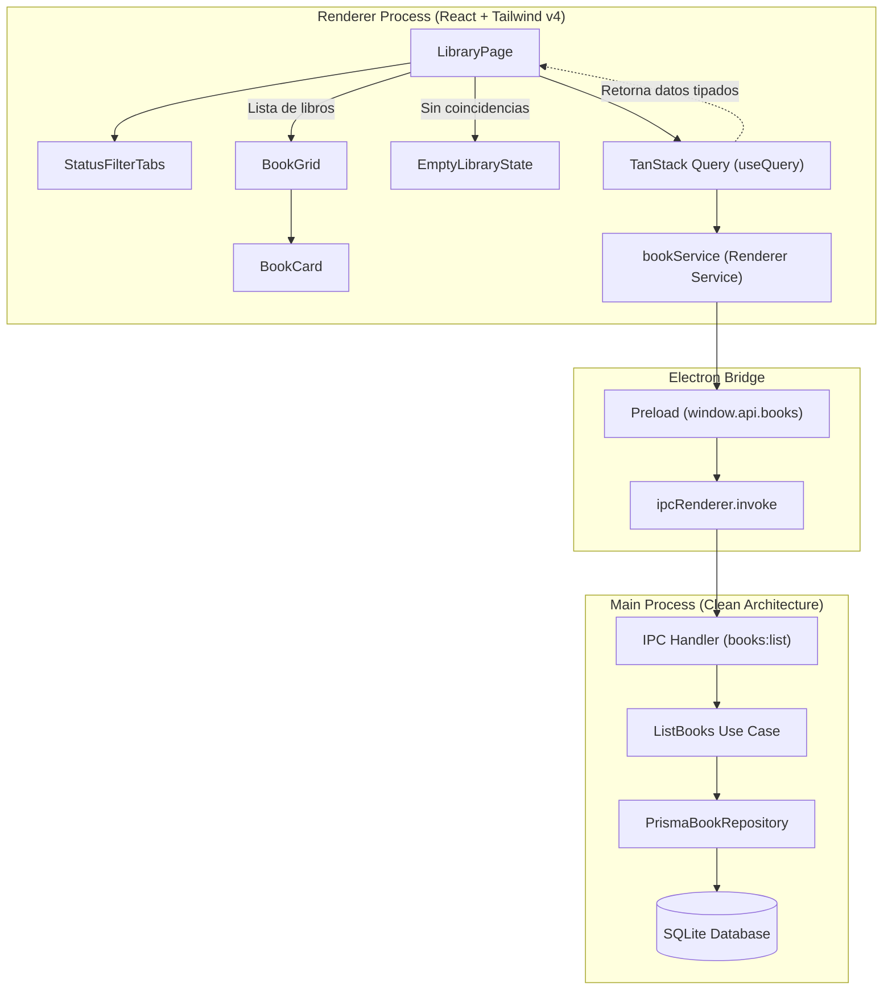
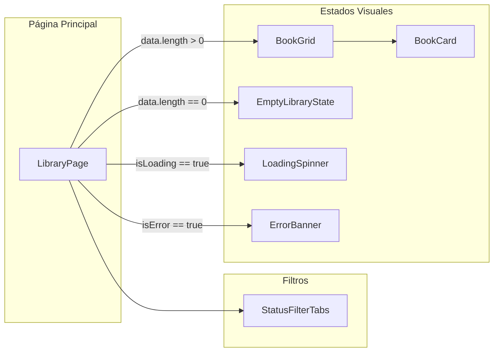

# Guía de Integración: TanStack Query, Tailwind CSS v4 e IPC en la Vista de Biblioteca

Esta guía técnica explica la arquitectura, el flujo de datos y los patrones de interfaz implementados para la Feature #8 (`ui_library_view`) en **BookLog**.

---

## 1. Arquitectura General del Flujo de Datos

A diferencia de una aplicación web tradicional conectada a una API HTTP remota, BookLog corre en Electron. Sin embargo, la comunicación entre el proceso de renderizado (React) y el proceso principal (Node.js/Prisma/SQLite) sigue un patrón cliente-servidor asíncrono sobre el canal IPC.

El siguiente diagrama ilustra el flujo completo desde la interfaz de usuario hasta la persistencia:



---

## 2. Integración de TanStack Query con el Servicio IPC

### 2.1 Desempaquetado del Patrón `IpcResult<T>`

Todos los métodos expuestos por `window.api` y los servicios envoltorios (`src/renderer/src/services/bookService.ts`) devuelven una promesa con el contrato:

```typescript
export type IpcResult<T> =
  | { success: true; data: T }
  | { success: false; error: string; code?: string }
```

TanStack Query asume que una consulta falla si la función de `queryFn` arroja una excepción (`throw new Error(...)`). Por tanto, la función query desenvuelve el resultado:

```typescript
const { data: books, isLoading, isError, error, refetch } = useQuery<BookPrimitives[], Error>({
  queryKey: ['books', selectedStatus],
  queryFn: async () => {
    const dto = selectedStatus === 'ALL' ? undefined : { status: selectedStatus }
    const res = await bookService.list(dto)
    if (!res.success) {
      throw new Error(res.error || 'No se pudo cargar la biblioteca')
    }
    return res.data
  }
})
```

### 2.2 Estrategia de Caché para Aplicaciones de Escritorio

Las aplicaciones de escritorio locales tienen dinámicas diferentes a las aplicaciones web:
- **`retry: false`**: Las excepciones en SQLite o de validación no son caídas transitorias de conexión de red; reintentar tres veces no resolverá un error estructural y ralentiza la experiencia.
- **`refetchOnWindowFocus: false`**: Cambiar de ventana en el sistema operativo no debe disparar consultas constantes al disco.
- **`staleTime: 5 min`**: Los datos locales se consideran frescos en memoria, garantizando navegación instantánea sin parpadeos de carga.

---

## 3. Jerarquía y Responsabilidades de Componentes



### Componentes Principales:

1. **`StatusFilterTabs` (`src/renderer/src/components/StatusFilterTabs.tsx`):**
   - Renderiza pestañas accesibles (`role="tab"`, `aria-selected`).
   - Soporta estados: `ALL`, `TO_READ`, `READING`, `PAUSED`, `FINISHED`, `ABANDONED`.
   - Incluye badges con conteos de libros por estado cuando se proveen.

2. **`BookCard` (`src/renderer/src/components/BookCard.tsx`):**
   - **Portadas:** Resuelve URLs con `resolveCoverUrl`. Si no hay portada o falla (`onError`), renderiza el placeholder neutro con el ícono `BookOpen`.
   - **Badge de Estado:** Etiquetas con colores distintivos por estado (`bg-emerald-500/10` para `READING`, `bg-sky-500/10` para `TO_READ`, etc.).
   - **Barra de Progreso Minimalista:** Exclusiva para estados con avance (`READING`, `PAUSED`, `ABANDONED`). Muestra una barra visual y el porcentaje numérico (ej: `65%`), sin textos distractores.
   - **Calificación:** 5 estrellas (`Star` de Lucide) que se iluminan según el rating asignado.

3. **`BookGrid` (`src/renderer/src/components/BookGrid.tsx`):**
   - Cuadrícula responsive con Tailwind CSS: `grid-cols-1 sm:grid-cols-2 md:grid-cols-3 lg:grid-cols-4`.

4. **`EmptyLibraryState` (`src/renderer/src/components/EmptyLibraryState.tsx`):**
   - Presentación amigable cuando la biblioteca no tiene libros o cuando ningún libro coincide con el filtro activo.
   - Botón interactivo para restablecer el filtro a "Todos".

5. **`LibraryPage` (`src/renderer/src/pages/LibraryPage.tsx`):**
   - Vista orquestadora conectada a TanStack Query.
   - Manejo de estados: cargando, error con reintento, biblioteca vacía y cuadrícula de tarjetas.

---

## 4. Estilos con Tailwind CSS v4

BookLog utiliza Tailwind CSS v4 importado en `src/renderer/src/assets/main.css`:

```css
@import "tailwindcss";
```

### Aspectos Clave de Diseño:
- **Tema Oscuro Sobrio:** Fondo principal `bg-slate-900`, tarjetas en `bg-slate-800`, bordes en `slate-700/60` y texto primario en `text-slate-100`.
- **Acentos Funcionales:** El color `indigo-600` se utiliza para acciones primarias y el indicador de tab activa. Los estados de libro usan tonos semánticos con opacidad suave (`emerald` para lectura activa, `amber` para pausado, `indigo` para terminado, `rose` para abandonado, `sky` para pendiente).
- **Proporción de Portadas:** Aspect ratio uniforme de 2:3 (`aspect-[2/3]`) con `object-cover` para una alineación visual perfecta de la cuadrícula.

---

## 5. Estrategia de Testing

Para garantizar la fiabilidad sin levantar Electron en las pruebas unitarias:
- Se utiliza `vitest` con el plugin oficial `@vitejs/plugin-react` y directiva `@vitest-environment jsdom`.
- Los tests en `tests/renderer/test_library_view.test.ts` verifican:
  1. Renderizado y accesibilidad de `StatusFilterTabs`.
  2. Comportamiento de `BookCard` (cálculo de porcentajes, renderizado de estrellas, badges, fallback de portada ante fallos).
  3. Comportamiento reactivo de `LibraryPage` ante respuestas simuladas de `bookService.list`.
  4. Transiciones de estado (carga, error, reintento, listas vacías).
