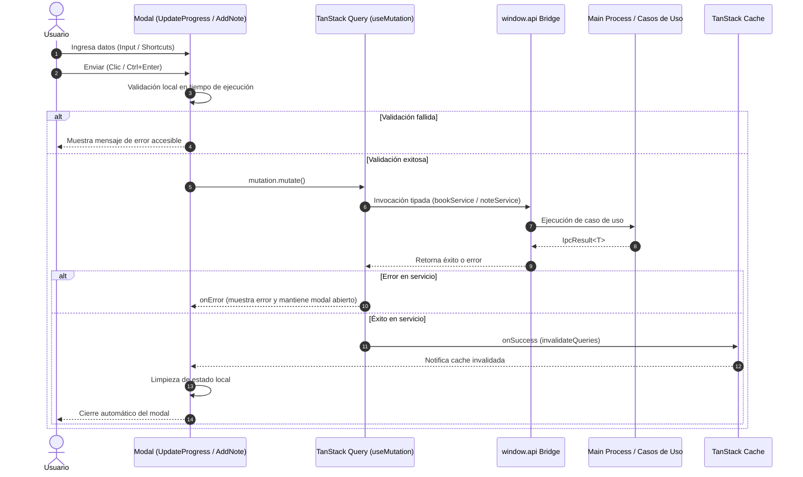

# Guía Técnica: Componentes Modales Reutilizables en React (`UpdateProgressModal` y `AddNoteModal`)

Esta guía describe los patrones de diseño, accesibilidad, manejo de estado reactivo y mutaciones con TanStack Query empleados en la suite de modales de BookLog para la actualización de progreso (`UpdateProgressModal`) y la captura de notas/reflexiones (`AddNoteModal`).

---

## 1. Arquitectura de Componentes Modales

En BookLog, los componentes modales son diseñados como unidades desacopladas y reutilizables. No dependen del árbol de la vista que los invoca y pueden ser consumidos desde cualquier página (e.g. `BookDetailPage`, `LibraryPage`, vistas de estadísticas o widgets futuros).

```mermaid
graph TD
    subgraph "Vistas Consumidoras"
        DP[BookDetailPage]
        LP[LibraryPage / Dashboard]
    end

    subgraph "Modales Reutilizables (UI Components)"
        UPM["UpdateProgressModal\n(book, isOpen, onClose)"]
        ANM["AddNoteModal\n(bookId, isOpen, onClose, bookTitle?)"]
    end

    subgraph "Capa de Servicios Frontend"
        BS[bookService.updateProgress\nbookService.updateStatus]
        NS[noteService.create]
    end

    subgraph "React Query Cache"
        QC[QueryClient]
    end

    DP -->|Abre con botón| UPM
    DP -->|Abre con botón| ANM
    LP -.->|Puede invocar| UPM
    LP -.->|Puede invocar| ANM

    UPM -->|Invoca mutación| BS
    UPM -->|Invalida ['book', id], ['books']| QC
    ANM -->|Invoca mutación| NS
    ANM -->|Invalida ['notes', bookId]| QC
```

---

## 2. Flujo de Mutación y Estados Reactivos

El ciclo de vida de una operación dentro de los modales sigue el siguiente flujo estructurado:



---

## 3. Especificación de Componentes

### 3.1. `UpdateProgressModal`

Permite registrar el avance de lectura con soporte dual para lectores que prefieren medir páginas físicas o porcentaje.

- **Props**:
  - `book: BookPrimitives`: Datos del libro actual.
  - `isOpen: boolean`: Control de visibilidad.
  - `onClose: () => void`: Callback de cierre.
- **Selector de Modo ("Por página" vs "Por porcentaje")**:
  - Pestañas estilo segmented control accesibles (`role="tablist"`, `role="tab"`).
  - Si el libro no cuenta con total de páginas (`pageCount === null`), el modo se ajusta automáticamente a porcentaje y se ocultan cálculos proporcionales.
- **Cálculo Dinámico Bidireccional**:
  - Al cambiar de página: `Math.round((página / pageCount) * 100)`.
  - Al cambiar de porcentaje: `Math.round((porcentaje / 100) * pageCount)`.
- **Sugerencia Interactiva de Finalización**:
  - Cuando el usuario alcanza la última página o el 100%, emerge un banner de felicitaciones con un checkbox: *"¿Marcar libro como terminado (FINISHED)?"*, activo por defecto.
  - Si el usuario decide desmarcarlo, el libro preserva o restaura su estado anterior sin forzar la finalización.

### 3.2. `AddNoteModal`

Diseñado para notas rápidas, citas e ideas sin fricción ni campos innecesarios.

- **Props**:
  - `bookId: number`: Identificador del libro al cual pertenece la nota.
  - `isOpen: boolean`: Visibilidad.
  - `onClose: () => void`: Callback de cierre.
  - `bookTitle?: string`: Título opcional del libro mostrado en el encabezado.
- **Atajo de Teclado Rápido**:
  - `Ctrl + Enter` (Windows/Linux) o `Cmd + Enter` (macOS) dentro del área de texto para guardar sin recurrir al cursor.
- **Validación**:
  - No permite entradas vacías o solo espacios en blanco.

---

## 4. Accesibilidad y Ergonomía (UX/A11y)

1. **Atributos ARIA Semánticos:** Los modales incluyen `role="dialog"`, `aria-modal="true"`, `aria-labelledby`, garantizando lectura correcta para lectores de pantalla.
2. **Cierre con Teclado (Escape):** Un listener global en `useEffect` escucha `Escape` y ejecuta `onClose`.
3. **Cierre por Backdrop:** Clic en la capa de fondo (`e.target === e.currentTarget`) cierra la ventana sin interrumpir interacciones dentro del cuerpo modal.
4. **Foco y Ergonomía:** Inputs principales con atributo `autoFocus` para comenzar a escribir inmediatamente al abrir el modal.
