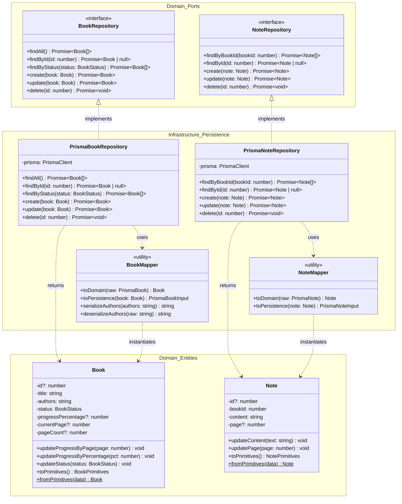
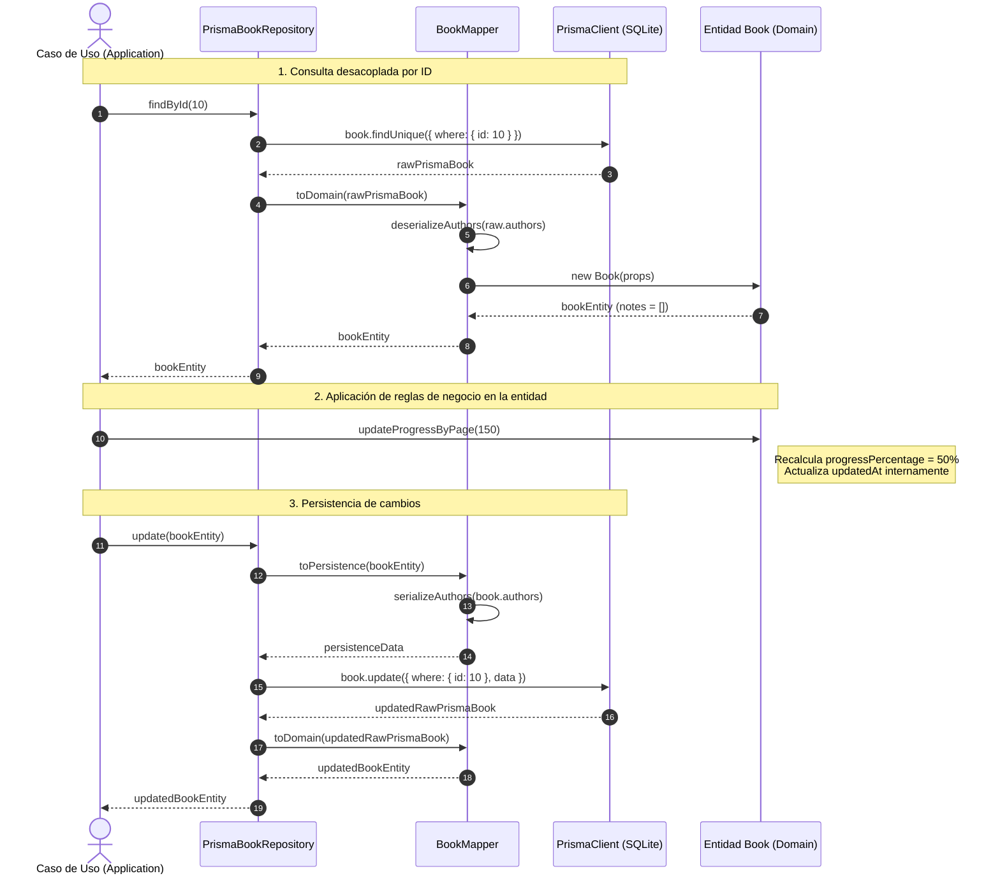

# Guía Conceptual: Patrón Repository y Data Mapper con Prisma en Clean Architecture

## 1. Introducción y Fundamentos Arquitectónicos

En el desarrollo de **BookLog**, la arquitectura del software sigue estrictamente los principios de **Clean Architecture** (Arquitectura Limpia) y el diseño de **Puertos y Adaptadores** (*Hexagonal Architecture*).

Uno de los principales retos en aplicaciones con almacenamiento relacional (como SQLite a través de Prisma ORM) es prevenir la filtración de detalles tecnológicos de la base de datos hacia las capas de lógica de negocio (casos de uso y entidades del dominio).

Para solucionar esto, se aplican dos patrones de diseño complementarios definidos por Martin Fowler:
1. **Patrón Repository (Repositorio):** Media entre la capa de dominio y la capa de mapeo de datos, actuando como una colección en memoria de objetos de dominio.
2. **Patrón Data Mapper (Mapeador de Datos):** Capa de software que separa los objetos en memoria de la base de datos, transmitiendo datos entre ambos sin que ninguno dependa del otro.

---

## 2. Separación entre Entidades de Dominio y Modelos de Persistencia

### ¿Por qué no usar los modelos de Prisma como entidades de dominio?

Prisma genera tipos de TypeScript que reflejan fielmente el esquema relacional (`model Book`, `model Note`). Sin embargo, los modelos de Prisma son **anémicos** (simples bolsas de datos sin comportamiento ni encapsulación de reglas de negocio):
- No protegen invariantes de negocio (por ejemplo, validación de que la página actual no supere el total de páginas, o que las calificaciones solo admitan valores entre 1 y 5).
- Su estructura está optimizada para la persistencia relacional en SQLite (por ejemplo, `authors` como string plano o JSON stringificado), mientras que el dominio requiere estructuras ricas con métodos de mutación seguros (`updateProgressByPage`, `updateStatus`).
- Si la lógica de la aplicación dependiera directamente de Prisma, cualquier cambio en el motor de base de datos o en la estructura relacional obligaría a refactorizar todo el núcleo del sistema.

### Comparativa: Entidades vs Modelos Prisma

| Dimensión | Entidad de Dominio (`Book`, `Note`) | Modelo de Persistencia Prisma (`PrismaBook`, `PrismaNote`) |
|---|---|---|
| **Capa** | `src/shared/domain/` | `@prisma/client` / Infraestructura |
| **Comportamiento** | Métodos ricos de cálculo, mutación controlada e invariantes | Estructura puramente de datos (DTO anémico) |
| **Dependencias** | TypeScript puro, cero dependencias externas | Depende del motor Prisma y driver SQLite |
| **Relaciones** | Agregados con carga explícita y desacoplada | Relaciones relacionales (Foreign Keys, JOINs) |
| **Manejo de autores** | Manejo semántico de nombres de autor | Serializado como JSON array en campo `TEXT` |

---

## 3. Diagrama de Clases del Sistema de Persistencia

---

## 4. Diagrama de Secuencia: Ciclo de Consulta y Actualización

El siguiente diagrama ilustra el flujo de una operación típica donde un caso de uso consulta un libro, muta su progreso según reglas de negocio y persiste el resultado a través del repositorio:

---

## 5. Decisiones Clave de Implementación

### Carga de Notas Desacoplada
Para optimizar las vistas generales de la biblioteca y listados por estado, `findAll()` y `findById()` de `PrismaBookRepository` **no realizan JOINs ni incluyen notas por defecto**. Las notas se cargan de forma diferida y específica a través de `PrismaNoteRepository.findByBookId(bookId)`.

### Serialización Segura de Autores
Dado que SQLite almacena listas como cadenas de texto, `BookMapper` implementa deserialización tolerante a fallos:
- Si la base contiene un array JSON (`'["Autor 1", "Autor 2"]'`), lo deserializa y une como lista legible.
- Si contiene una cadena simple (datos heredados o migraciones), la respeta sin generar excepciones.
- Al persistir, transforma las cadenas de autores en un array JSON formal para mantener la coherencia relacional.

### Ordenamiento Predictivo
- **Libros (`findAll`, `findByStatus`):** Orden descendente por `updatedAt DESC` para que los libros con actividad reciente figuren en los primeros lugares de la interfaz.
- **Notas (`findByBookId`):** Orden cronológico ascendente `createdAt ASC` para preservar el hilo de reflexiones del usuario a lo largo de su lectura.
